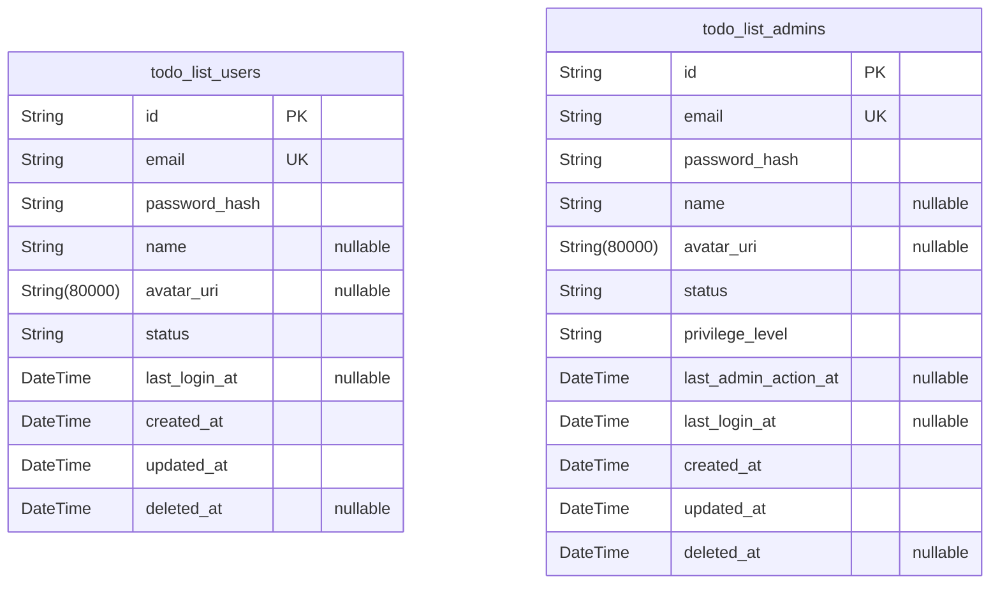
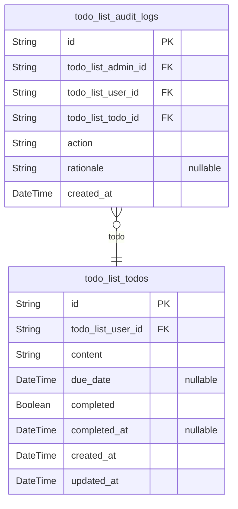

# Prisma Markdown

> Generated by [`prisma-markdown`](https://github.com/samchon/prisma-markdown)

- [Actors](#actors)
- [Todos](#todos)

## Actors

### `todo_list_users`

Application users table. Stores core account/authentication credentials,
registration data, profile fields, and business status for each user.
Used to verify personal identity, manage sessions, and enforce
user-specific business rules. Core relationships: owns many todos (see
[todo_list_todos](#todo_list_todos)), is target for logs. Cannot perform privileged
admin actions. Users are independently managed entities representing the
main service customer base.

Properties as follows:

- `id`: Primary Key.
- `email`
  > User's unique login email address. Used for authentication and
  > identification. Must be unique for each user and serve as primary contact
  > for registration, password recovery, and notifications.
- `password_hash`
  > Bcrypt/argon2 hashed password for authentication. NEVER stores plain
  > password. Required for user login.
- `name`
  > Optional user display name for UI and search. Can be empty or null if not
  > set by user. Not enforced to be unique.
- `avatar_uri`
  > Optional field for user's profile/avatar image URL. Useful for
  > personalized interfaces. Null if user does not set.
- `status`
  > Current account status (e.g., active, locked, disabled). Used for
  > lifecycle control, login restriction, or compliance. Business logic
  > enforces legal values; implement as string here for flexibility.
- `last_login_at`
  > Timestamp of user's most recent successful login. Used for security and
  > audit. Null if never logged in yet.
- `created_at`: Record creation time (UTC). Used for audit trail and time-based queries.
- `updated_at`: Timestamp of most recent data update to the user record.
- `deleted_at`
  > Soft-deletion timestamp. If not null, user is considered deleted (not
  > visible in main listings, subject to compliance retention).

### `todo_list_admins`

Administrator accounts table. Stores admin credentials, authentication,
status, profile, and privileged operational data. Used to manage and
operate all aspects of the Todo List service and review or delete user
todos as necessary. Requires auditability of all administrative actions.
Account is distinct from regular users for business control and
compliance, isolating admin roles from end-user personas.

Properties as follows:

- `id`: Primary Key.
- `email`
  > Administrator's unique login email. For secure privileged access only.
  > Must be unique among admin accounts.
- `password_hash`
  > Hash of admin's password, as in user accounts. For login authentication
  > (bcrypt/argon2 hash).
- `name`
  > Administrator's display name for UI, policy, and audit references.
  > Nullable if not set but strongly encouraged for logging.
- `avatar_uri`: Optional admin profile/avatar image.
- `status`
  > Current admin account status (e.g., active, locked, disabled, suspended).
  > Used for controlling access to admin actions; values managed by business
  > logic.
- `privilege_level`
  > Business-defined privilege level (e.g., superadmin, support, auditor).
  > Used for assigning different sets of administrative permissions within
  > the admin domain.
- `last_admin_action_at`
  > Timestamp of the admin's most recent privileged operational action (e.g.,
  > delete user todo, set announcement). Used for audit tracking and
  > accountability.
- `last_login_at`
  > Timestamp of the administrator's last successful login. Used for security
  > and operational auditing.
- `created_at`
  > Admin account creation timestamp (UTC). Used for onboarding tracking and
  > auditing.
- `updated_at`: Most recent update timestamp, for audit and policy enforcement.
- `deleted_at`
  > Soft-delete timestamp; if not null, admin account is technically deleted
  > or suspended.

## Todos

### `todo_list_todos`

Represents individual tasks (todos) created and owned by users. Each todo
can have content (with a business rule of maximum 255 characters),
optional due date, and a completed status. Only the owner (or an admin)
can view, edit, mark complete/incomplete, or delete each todo. This table
supports per-user task management, access enforcement, and core
productivity operations. Cross-references todo_list_users for ownership
linkage.

Properties as follows:

- `id`: Primary Key.
- `todo_list_user_id`
  > Owner user's [todo_list_users.id](#todo_list_users). Indicates which user this todo
  > belongs to.
- `content`
  > The textual content of the todo. Maximum 255 characters, trimmed of
  > whitespace, must not be empty or only whitespace. Validated business
  > rules (no control characters, required).
- `due_date`
  > Optional due date for the todo, null if not set. If present, must be an
  > ISO date not before creation date.
- `completed`
  > Whether the todo has been marked as completed. Defaults to false on
  > creation, toggled by user action.
- `completed_at`: Timestamp when the todo was marked as completed. Null if not completed.
- `created_at`: When this todo was created.
- `updated_at`
  > Timestamp of the last modification to this todo (edit, status change,
  > etc).

### `todo_list_audit_logs`

Records all admin-initiated actions affecting any user's todos, such as
viewing or deleting a user's todo for compliance or security purposes.
Captures admin username, affected user, target todo, admin action (enum:
'view', 'delete'), rationale (optional free text), and audit timestamp.
Supports privacy compliance, monitoring, and traceability in accordance
with business and legal policy.

Properties as follows:

- `id`: Primary Key.
- `todo_list_admin_id`: Admin's [todo_list_admins.id](#todo_list_admins) who performed the action.
- `todo_list_user_id`
  > Target user's [todo_list_users.id](#todo_list_users) whose todo was affected or
  > accessed.
- `todo_list_todo_id`: Target todo's [todo_list_todos.id](#todo_list_todos) affected by the admin action.
- `action`: Admin action type on the todo. Enum: 'view', 'delete'.
- `rationale`
  > Optional explanation or justification text for the admin action. Free
  > text field; null allowed for non-sensitive actions.
- `created_at`: Timestamp when this audit log entry was created.
