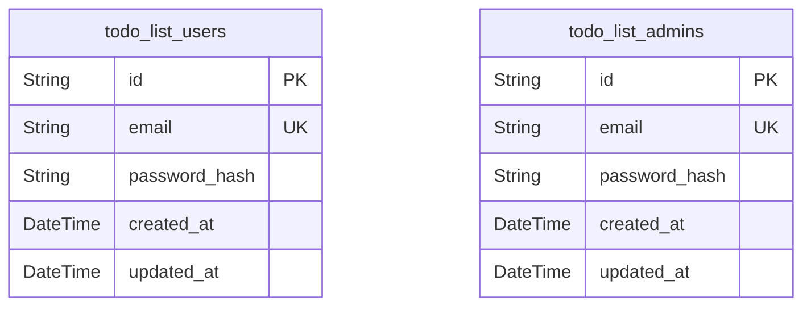
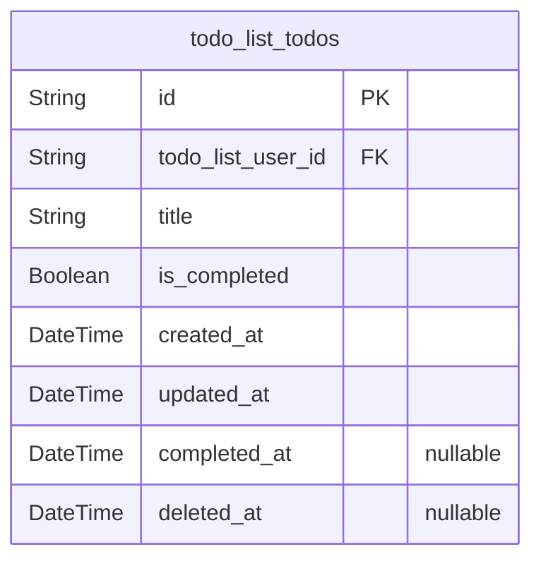

# Prisma Markdown

> Generated by [`prisma-markdown`](https://github.com/samchon/prisma-markdown)

- [Actors](#actors)
- [Todos](#todos)

## Actors

### `todo_list_users`

Registered end-user accounts for the minimal Todo app. Each record
represents a single user allowed to log in, manage only their own todos,
and perform all personal account actions. Emails are unique per table,
and password security is enforced via password_hash field. No admin
permissions given. Creation and update timestamps are included for audit
and compliance. Does not reference todo_list_todos here (reverse
reference handled in todo table).

Properties as follows:

- `id`: Primary Key.
- `email`
  > User's unique email address for login and identification. Must be unique
  > within this table.
- `password_hash`
  > User password (hashed, never stored in plain text). Required for secure
  > authentication.
- `created_at`: Timestamp when the user account was created (ISO 8601, UTC).
- `updated_at`: Timestamp when the user account was last updated (ISO 8601, UTC).

### `todo_list_admins`

Administrator accounts for system-wide management of users and todos.
Records here represent authorized admins with full privileges to view,
edit, or delete any todo or user account. Admins log in using a unique
email and their password (hashed). No user role overlap—admins are not
standard users. Minimal fields for authentication and audit. No direct
relation to user or todo tables. Deleted when account is removed (no soft
delete).

Properties as follows:

- `id`: Primary Key.
- `email`
  > Admin's unique email address for login. Must be unique within this table
  > only.
- `password_hash`: Admin password hash, required for secure login.
- `created_at`: Admin account creation timestamp.
- `updated_at`: Timestamp of last modification to this admin account.

## Todos

### `todo_list_todos`

Todo list items representing individual user tasks in the minimal Todo
application. Each todo is strictly owned by a single user via the {@link
todo_list_users.id} foreign key. The table stores only essential fields:
task title, completion status, timestamps for creation/update/completion,
and optional soft delete flag (for future extensibility). No labels,
priorities, deadlines, or attachments are included, adhering to strict
minimalism. Admin users may manage all todos via permissions, not via
extra fields.

Properties as follows:

- `id`: Primary Key.
- `todo_list_user_id`
  > Belonged user's [todo_list_users.id](#todo_list_users). Enforces ownership and
  > enables cascading deletes when user is removed.
- `title`
  > Todo item label/title. Must be non-empty and max 100 characters, trimmed.
  > (Validated in service logic, enforced at application layer.)
- `is_completed`
  > Whether the todo item is marked as completed (true) or still active
  > (false).
- `created_at`: Timestamp when the todo item was created. Used for sort and audit.
- `updated_at`: Timestamp for most recent modification (description, status change, etc.).
- `completed_at`
  > If completed, timestamp at which the task was marked as done; set to null
  > if not completed.
- `deleted_at`
  > Soft delete timestamp; if present, item is considered logically deleted
  > but not removed from database. Enables future extensibility for
  > audit/recovery.
