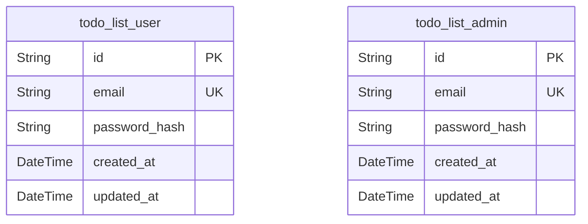
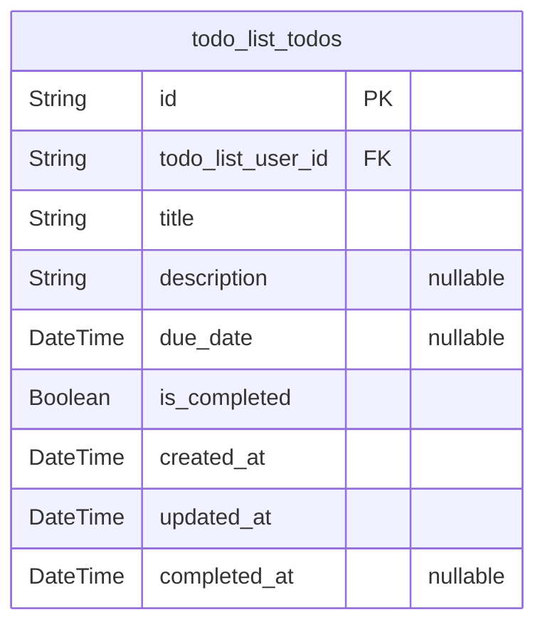

# Prisma Markdown

> Generated by [`prisma-markdown`](https://github.com/samchon/prisma-markdown)

- [Actors](#actors)
- [Todos](#todos)

## Actors

### `todo_list_user`

Registered user account for the Todo List application. Represents an
individual who can authenticate, own todos, and perform all standard user
operations. This entity is the core principal for business workflow,
privacy boundaries, and ownership tracking. Each record manages
authentication (email, password hash) and account timestamps. Independent
CRUD management is supported. Admin users are defined separately in
[todo_list_admin](#todo_list_admin).

Properties as follows:

- `id`: Primary Key.
- `email`
  > User's unique email address for authentication and identity. Must be
  > unique per user and used as primary login credential.
- `password_hash`
  > Secure hash of the user's authentication password for login. Never store
  > plain text passwords; always hash before storage.
- `created_at`: Timestamp when the user account was created.
- `updated_at`: Timestamp of the most recent update to the user account details.

### `todo_list_admin`

Administrator account with system-wide privileges. Manages authentication
for privileged access, granting ability to moderate, view, or delete any
user's todos, and manage user accounts. Used exclusively for admin
authentication and role isolation, ensuring compliance and separation of
admin operations from standard users ([todo_list_user](#todo_list_user)).
Independent CRUD management is supported. Audit trails and business
constraints are enforced via separate logging and security
infrastructure.

Properties as follows:

- `id`: Primary Key.
- `email`
  > Admin's unique email address for authentication. Must be unique per admin
  > and used as primary login credential for privileged access.
- `password_hash`
  > Secure hash of the admin's authentication password. All passwords must be
  > hashed before storage for compliance and protection.
- `created_at`: Timestamp marking account creation for this admin profile.
- `updated_at`: Most recent timestamp when the admin account was updated.

## Todos

### `todo_list_todos`

Represents individual todo items within the Todo List application. Each
record is tied to the user who owns it, and includes all necessary
business fields to support creation, editing, filtering, sorting,
completion state, and administrative moderation. Tracks all
workflow/audit fields required by business (timestamps, status,
ownership) and enables both end-user and admin scenarios as defined by
business rules. User ownership enforced by a foreign key to the already
existing 'todo_list_user' table. No soft-delete, all deletions are
permanent; no historical snapshot/version tables required for MVP.

Properties as follows:

- `id`: Primary Key.
- `todo_list_user_id`
  > Belonged user's [todo_list_user.id](#todo_list_user). Establishes todo ownership and
  > enforces per-user access control.
- `title`
  > Title of the todo item. Required field, used for display and search.
  > Maximum 255 characters, trimmed of leading/trailing whitespace.
- `description`
  > Optional details about the todo item. Maximum 2000 characters. Trimmed of
  > whitespace, supports search and filtering.
- `due_date`
  > Optional due date by which the todo should be completed. Must be today or
  > a future date. Used for filtering overdue and upcoming todos.
- `is_completed`
  > Completion status. True if todo is complete, false otherwise. Used for
  > filtering and status toggling.
- `created_at`
  > Timestamp for when the todo was created. Set automatically at creation.
  > Used for sorting and audit.
- `updated_at`
  > Timestamp of the last modification to the todo (edit, status change,
  > etc). Set automatically by system.
- `completed_at`
  > Timestamp marking completion of the todo. Null if incomplete; set to time
  > when marked complete. Allows audit/history funding and business logic for
  > reporting.
