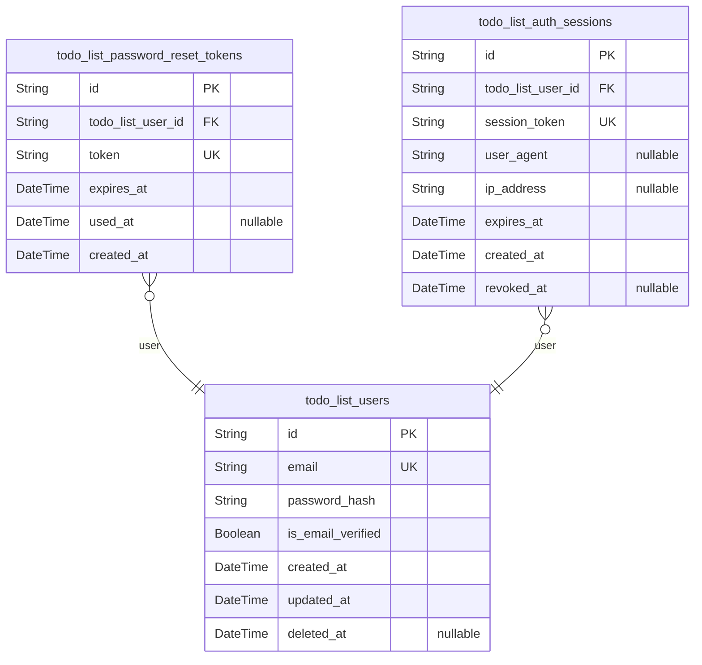
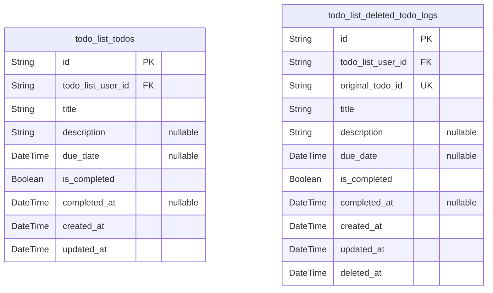

# Prisma Markdown

> Generated by [`prisma-markdown`](https://github.com/samchon/prisma-markdown)

- [Actors](#actors)
- [Todos](#todos)

## Actors

### `todo_list_users`

Registered application users. Represents individuals with private
accounts for the Todo List service. Primary business entity for all
authentication, authorization, and account lifecycle operations. Uniquely
identified by email for login. Related entities include password reset
tokens and active authentication sessions. On deletion, related todo
items and session data must be automatically purged for privacy
compliance.

Properties as follows:

- `id`: Primary Key.
- `email`
  > User's email address for authentication and communication. Must be unique
  > across all users, case-insensitive. Used for login and account recovery.
- `password_hash`
  > Securely salted hash of the user's password. Never stores the plain
  > password. Used only for credential verification on login.
- `is_email_verified`
  > Flag indicating whether the user has successfully completed email
  > ownership verification. Used to enable/disable access prior to
  > verification.
- `created_at`: Timestamp for when the user account was created.
- `updated_at`
  > Timestamp for the latest user account update (profile/email/password
  > change).
- `deleted_at`
  > Timestamp for soft deletion (account scheduled for deletion or pending
  > GDPR removal). Null if active.

### `todo_list_password_reset_tokens`

Single-use tokens enabling secure password reset for a user account.
Tokens are time-limited and bound to the requesting user. Not
independently manageable; always created in response to a password reset
request and deleted after use or expiry. Supports audit/compliance
workflows for account recovery.

Properties as follows:

- `id`: Primary Key.
- `todo_list_user_id`
  > Belonged user's [todo_list_users.id](#todo_list_users). Associates this reset token
  > with a user account for verification and recovery purposes.
- `token`
  > Randomly generated, cryptographically secure token string. Used to verify
  > password reset intent. Single-use only.
- `expires_at`
  > Token expiration timestamp. After this point, the token is invalidated by
  > the system.
- `used_at`
  > Timestamp when this password reset token was actually used by the user.
  > Null if not yet used.
- `created_at`: Timestamp when this reset token record was created.

### `todo_list_auth_sessions`

Records of authenticated sessions for each user. Enables session token
revocation, tracking of active logins for security, automatic expiry, and
support for global logout on password or email change. Each session is
tied to a user and uniquely identified by session_token. Not directly
managed by users.

Properties as follows:

- `id`: Primary Key.
- `todo_list_user_id`
  > Belonged user's [todo_list_users.id](#todo_list_users). Associates session with a
  > single user for permission enforcement and session history/auditing.
- `session_token`
  > Opaque authentication token for this session (e.g., JWT or securely
  > random string). Used for session validation on each API request.
- `user_agent`
  > Information about client browser, device, and OS for security logging and
  > session management.
- `ip_address`
  > Most recent client IP address associated with the session. Used for
  > security auditing and suspicious activity detection. Optional due to
  > privacy policy constraints.
- `expires_at`
  > Session expiration timestamp; after this date the session is no longer
  > valid.
- `created_at`: Timestamp for when the session was established.
- `revoked_at`
  > Timestamp when the session was explicitly revoked/logged out. Null if
  > active.

## Todos

### `todo_list_todos`

Active todo items belonging to a single user. Each todo can be created,
viewed, updated, completed, or deleted only by its owner. Business rules
require strong ownership enforcement, title uniqueness (incomplete todos
only), field validation, full CRUD operations, and audit support through
append-only deletion log. References the user in {@link
todo_list_users.id}.

Properties as follows:

- `id`: Primary Key.
- `todo_list_user_id`: Belonged user's [todo_list_users.id](#todo_list_users) who owns this todo item.
- `title`
  > Title of the todo item. Business constraint: required, 1–255 chars,
  > unique among incomplete todos for the owner.
- `description`
  > Optional user-provided description or details for the todo. Max 1000
  > characters, may be empty.
- `due_date`
  > Optional due date for the todo. Must be in the future when provided, null
  > if unset.
- `is_completed`
  > Whether this todo item has been marked as completed by the owner.
  > Defaults to false on creation. May be toggled true/false by user.
- `completed_at`: Timestamp when this todo was marked as completed. Null until completed.
- `created_at`: Timestamp when the todo was created. Required for all todos.
- `updated_at`: Timestamp of last update to any field of the todo. Updated on every edit.

### `todo_list_deleted_todo_logs`

Historical log of deleted todo items. Functions as an append-only,
immutable audit log for todos deleted by users. Supports business
requirement allowing users to view deleted todos for up to 30 days after
removal. References both the original todo's ID and the owning user.
Retains all business fields for forensic and self-service recovery/audit
purposes.

Properties as follows:

- `id`: Primary Key.
- `todo_list_user_id`: User's [todo_list_users.id](#todo_list_users) who originally owned the deleted todo.
- `original_todo_id`
  > ID of the deleted todo as it was in [todo_list_todos.id](#todo_list_todos). Used for
  > traceability and ensuring unique deletion records.
- `title`
  > Title of the deleted todo at the time of deletion. Preserved for
  > user-facing audit and recovery history.
- `description`
  > Description (if any) for the deleted todo at the time of deletion.
  > Preserved for audit.
- `due_date`: Due date for the todo at deletion, or null if unset.
- `is_completed`
  > Completion status as it was at deletion time. For audit and possible
  > recovery logic.
- `completed_at`: When the todo was completed, as of deletion. Null if never completed.
- `created_at`
  > Original creation timestamp of the todo, as persisted in {@link
  > todo_list_todos.created_at}.
- `updated_at`
  > Last modification timestamp of the todo before deletion, as persisted in
  > [todo_list_todos.updated_at](#todo_list_todos).
- `deleted_at`
  > Timestamp when the deletion occurred; the audit log creation time for
  > snapshot purposes. Required for retention window enforcement.
