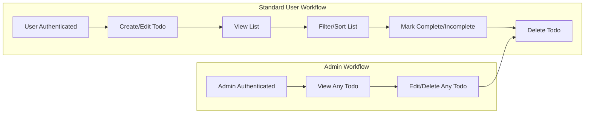

# Business Requirements Specification for Todo List Application

## Requirement Writing Guidelines

All requirements in this document:
- Are written for backend developers to implement the minimum functional todo management system
- Use the EARS (Easy Approach to Requirements Syntax) format (WHEN/WHILE/IF/WHERE, THE, SHALL, etc.) wherever applicable
- Define business goals in English (US), using formal, unambiguous language
- Describe what the system must do, not how to technically achieve it
- Cover only minimum, essential required functionality for a todo list

## Create Todo Item

- WHEN a registered user submits a new todo item, THE system SHALL create a new todo entry associated with that user.
- THE system SHALL require the following fields for each todo item at creation: title (required), description (optional), due date (optional), completion status (defaults to incomplete).
- IF the "title" field is missing or empty, THEN THE system SHALL reject the creation request and return a validation error with a specific message indicating that a title is required.
- THE system SHALL allow only the authenticated user to create todos for their own account.
- IF a user attempts to create a todo without being authenticated, THEN THE system SHALL reject the operation and return an unauthorized error.
- THE system SHALL trim leading and trailing whitespace on the "title" and "description" fields.
- THE system SHALL limit the "title" to a maximum of 255 characters, and the "description" to 2000 characters.
- IF the due date is provided, THEN THE system SHALL validate that it is either today or a future date; past dates SHALL be rejected with an appropriate validation error.
- THE system SHALL set the creation timestamp automatically for each new todo item.
- WHEN a new todo is created successfully, THE system SHALL return the unique identifier of the todo item to the user.

## Edit Todo Item

- WHEN a user submits a request to edit their own todo item, THE system SHALL allow modifications to the title, description, due date, and status fields.
- IF a user attempts to edit a todo item that does not belong to them (and they are not an admin), THEN THE system SHALL reject the request and return a permission error.
- THE system SHALL apply the same validation (title required, field lengths, due date rule) as during creation.
- IF a field is not included in the edit request, THEN THE system SHALL leave the original value unchanged.
- WHEN a todo is successfully updated, THE system SHALL store the modification timestamp.

## View Todo List

- WHEN a user requests to view their todo list, THE system SHALL return all todo items associated with that user, sorted by creation date descending (latest first) by default.
- WHERE an admin requests to view todos, THE system SHALL allow them to view todos created by any user.
- THE system SHALL return all fields for each todo: id, title, description, due date, completion status, creation timestamp, modification timestamp (if present), and owner (user id).
- IF an unauthenticated request to view a todo list is made, THEN THE system SHALL reject it with an unauthorized error.
- THE system SHALL support pagination for viewing todo lists: default page size 20, with a maximum page size of 100.
- THE system SHALL provide the total count of todos in each paged response.

## Update Todo Status (Complete/Incomplete)

- WHEN a user marks a todo item as complete or incomplete, THE system SHALL update the completion status accordingly.
- IF a user attempts to update the status of a todo item that does not belong to them (and they are not an admin), THEN THE system SHALL reject the operation and return a permission error.
- WHEN a todo is marked as complete, THE system SHALL record the completion timestamp.
- WHEN a todo is marked as incomplete, THE system SHALL clear any previously set completion timestamp.
- THE system SHALL allow only the authenticated user or an admin to perform status updates on a todo.

## Delete Todo Item

- WHEN a user requests to delete their own todo item, THE system SHALL permanently remove the todo item (soft deletion is not required for minimum functionality).
- IF a user attempts to delete a todo item that does not belong to them (and they are not an admin), THEN THE system SHALL reject the operation and return a permission error.
- WHEN an admin requests to delete any todo item, THE system SHALL always allow it, regardless of ownership.
- IF a delete operation is successful, THEN THE system SHALL return a confirmation response.
- IF a user attempts to delete a non-existent todo item, THEN THE system SHALL return a specific error indicating that the item does not exist.

## Todo List Filtering or Sorting (if any)

- WHERE a user requests to filter todos by completion status (complete, incomplete, or all), THE system SHALL return the filtered list according to the requested status.
- WHERE a user requests to filter todos by due date (e.g., due today, this week, overdue), THE system SHALL return only todos matching the specified due date filter.
- WHERE a user requests to sort their todo list by due date or creation date, THE system SHALL return todos sorted by the specified field, ascending or descending as specified.
- THE system SHALL support combining filtering and sorting, and apply pagination as described in "View Todo List".
- IF no filter or sort is requested, THEN THE system SHALL apply the default sort (creation date descending, all todos).

## Additional Cross-Sectional Requirements and Business Constraints

- THE system SHALL always enforce permissions according to the roles defined:
  - Regular users can only access, edit, update, or delete their own todos.
  - Admins can access, edit, update, or delete any user's todo.
- IF a required field is missing or malformed for any operation, THEN THE system SHALL return clear, actionable validation errors.
- WHILE a backend operation is processing (creation, update, delete), THE system SHALL respond within 2 seconds under normal load conditions.
- IF the system cannot respond within 2 seconds, THEN THE system SHALL log the delay for administrative review.
- THE system SHALL never expose user passwords or authentication tokens in any todo operation response.
- IF an internal error occurs during any todo operation, THEN THE system SHALL return a generic error message and SHALL NOT expose sensitive internal details.

## Sample Requirements Table (Reference)

| Operation                | Who Can Perform      | Success Criteria / Validations                              |
|-------------------------|---------------------|-------------------------------------------------------------|
| Create Todo             | Authenticated user  | Title required; length <=255; due date validity             |
| Edit Todo               | Own/Any (admin)     | Permission check; same validation as create                 |
| View Todos              | Own/Any (admin)     | Permission check; pagination                                |
| Update Status           | Own/Any (admin)     | Permission check; status toggling; timestamps               |
| Delete Todo             | Own/Any (admin)     | Permission check; existence; confirmation                   |
| Filter/Sort Todos       | Own/Any (admin)     | Filter parameter(s) validation; sorting/pagination applies  |

## Example Workflow Diagram

---

This document contains only business requirements for core Todo List functions necessary for implementation. All technical design and implementation details are the sole responsibility of the development team.