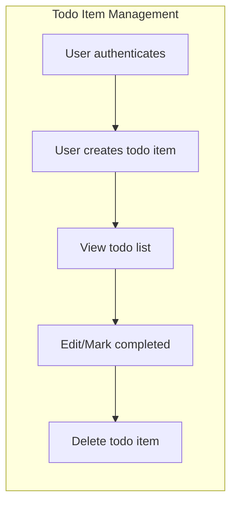

This report defines the overall business requirements, core workflows, user objectives, and the functional foundation for the Todo list application. The goal is to provide backend developers with comprehensive, actionable direction for implementing a minimal yet robust todo management service based on a single user role (user) with no collaborative features.

## Feature List and Priorities

**Core Features (MVP Scope)**
- User registration, login, password reset, and account updating
- Todo list creation: Users can create new todos
- Todo listing: Users can view all their own todos
- Todo updating: Users can modify title, description, completion status
- Todo deletion: Users can remove their own todos
- Individual todo access: Each todo is only visible to its creator

**Business Priorities**
- Security and privacy (no cross-user data leakage)
- Immediate feedback for success/failure of todo actions
- Simplicity—to minimize the number of steps required for todo management

## Business Processes

### Account Lifecycle
1. Registration: User provides email (must be unique) and password (must meet minimum requirements)
2. Login: User provides credentials, receives authentication token (session valid up to 30 days inactivity)
3. Update profile: User can change email or password, with input validation
4. Forgot/reset password: User initiates password reset process (email-based)
5. Logout: User invalidates session token

### Todo Item Lifecycle
1. Create: User submits title (required), optional description; default status is "incomplete"
2. View list: User views all personal todos, sorted by creation time (most recent first)
3. Update: User updates their own todo's title, description, or toggles "completed" status; on mark complete, a timestamp is recorded
4. Delete: User permanently deletes a personal todo; action is irreversible

### Authentication and Session Management
- All API operations for todos require authentication
- Each API request is tied to the authenticated user's context
- Persistence of auth token for smooth user experience (token expires after 30 days inactivity)

## Non-functional Requirements

- **Performance:** All todo-related actions SHALL complete and respond to users within 2 seconds under normal loads (EARS: THE system SHALL return every action result within 2 seconds in 95% of cases).
- **Reliability:** The todo application SHALL maintain 99.9% uptime, excluding scheduled maintenance windows (EARS: THE system SHALL be available 99.9% of the time monthly). 
- **Security:** Passwords SHALL be stored using cryptographically secure, salted hashing; todos and user data SHALL be isolated per user (EARS: THE system SHALL ensure only authenticated users can access their own data).
- **Data Privacy:** No user data SHALL be visible or accessible to any other user or third party. (EARS: THE system SHALL restrict todo and account access to the authenticated owner).
- **Integrity:** Each transaction (add, update, delete) SHALL be atomic, ensuring data accuracy (EARS: THE system SHALL guarantee atomic state for all todo operations).
- **Scalability constraint:** Service supports up to 500 active todos per user. (EARS: THE system SHALL restrict each user to a maximum of 500 active todos.).
- **Validation:** Todo title length is 1–255 characters; description is optional but capped (EARS: THE system SHALL enforce todo title between 1 and 255 chars).

## Business Rules

- Authentication required for all todo functions; no guest access (EARS: THE system SHALL require valid authentication before todo operations).
- Each user can access ONLY their own data—no cross-user permissions (EARS: THE system SHALL disallow access to todos not owned by the authenticated user).
- Todo must have title, optional description, completion status, and timestamps for creation. Completing a todo records the current timestamp.
- Password resets, email updates, and login attempts provide only generic error messages for invalid credentials (EARS: IF login/auth fails, THEN THE system SHALL return a generic error message.).
- User may delete any personal todo, which is then permanently removed and unrecoverable.
- Validation errors must be specifically reported, indicating which field failed and why (e.g., title too long).
- Service does not expose any feature for collaboration, delegation, or shared todo lists.

## Mermaid - Core Workflow

## Reference to Related Documents

- For authentication and session management, see [Authentication and Roles Requirements](./05-authentication-and-roles.md)
- For error scenarios and system responses, see [Error Handling Specifications](./07-error-handling.md)
- For technical constraints/security, see [Non-functional Requirements Details](./08-nonfunctional-requirements.md)

This document defines core business requirements only. All technical implementation decisions (architecture, database, API) are at the discretion of the development team.