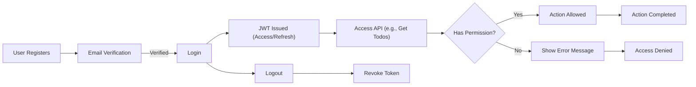

# User Roles and Authentication Requirements for Todo List Application

## User Role Definitions
The Todo list application defines two primary user roles: **user** and **admin**.

### Role: user
- A registered member who can create, read, update, and delete their own todos.
- Can mark their own todos as complete or incomplete.
- May view a personal list of their todos.
- Cannot access or modify other users' data or any administrative settings.

### Role: admin
- Has all privileges of a user.
- Can view any user's todos for maintenance or compliance.
- Can delete any user's todos for administrative or policy reasons.
- Can manage service operational settings (e.g., user management, service announcements).
- Cannot edit or create todos on behalf of another user (unless specified for business recovery).

## Permissions and Restrictions

### General Principle
THE system SHALL enforce strict, role-based access control for all core business actions, with no overlap in data manipulation between users and administrative tasks, except where specified for admin intervention.

### User (user role)
- THE user SHALL be able to create new todo items for their own account.
- WHEN user creates a todo, THE system SHALL associate the todo ONLY with that user.
- THE user SHALL be able to list, view, edit, and delete only their own todos.
- IF a user tries to access or modify another user's data, THEN THE system SHALL deny access and provide a clear error message.
- THE user SHALL be able to log in, log out, recover a lost password, and manage their own session.
- THE user SHALL NOT access service-wide settings or other users' data.

### Admin (admin role)
- THE admin SHALL have all capabilities of a user as described above.
- THE admin SHALL be able to list, view, and delete any user's todos. This action SHALL be used only for legitimate administrative or compliance purposes.
- WHEN deleting another user's todo, THE admin SHALL trigger a logging process for audit and traceability.
- THE admin SHALL be able to manage operational configurations, such as announcements, user status changes, and access restrictions.
- THE admin SHALL NOT create or edit todos for other users except in explicit business recovery cases (such as restoring data after failure), which SHALL be documented and logged.

## Authentication Requirements

### Registration Process
- THE system SHALL allow new users to register using a valid email address and password.
- WHEN a user registers, THE system SHALL verify that the provided email is unique and not previously registered.
- THE system SHALL provide a mechanism for the user to verify their email (e.g., via a time-limited verification code).
- IF registration fails due to already used email, THEN THE system SHALL display a business-level error message.

### Login and Session Management
- THE user SHALL be able to authenticate using their registered credentials (email and password).
- WHEN login is successful, THE system SHALL generate an authentication token (see Token Management section) and initiate a new session for the user.
- THE system SHALL prevent login attempts with invalid credentials.
- IF a login attempt fails, THEN THE system SHALL show a clear, business-appropriate error message (e.g., "Invalid email or password").
- THE system SHALL allow the user to log out at any time, invalidating any active session(s).

### Password and Account Management
- THE system SHALL provide a secure password reset process, using either a time-limited code or secure email link.
- WHEN a user requests a password reset, THE system SHALL send the appropriate verification to the user's registered email.
- IF the password reset link or code is expired or invalid, THEN THE system SHALL prevent reset and inform the user.
- THE user SHALL be able to change their password from their account settings.
- THE user SHALL be able to revoke all active sessions if compromised.

### Account Integrity
- THE system SHALL ensure that email-verification status is required before allowing full user functionality (e.g., creating todos).
- THE system SHALL not authorize dormant, deactivated, or deleted accounts.

## Role Hierarchy and Permission Matrix

The roles are strictly hierarchical: admin > user. Admin inherits all user permissions, with additional administrative capabilities as specified.

| Action                                                    | user | admin |
|-----------------------------------------------------------|:----:|:-----:|
| Register                                                  |  ✅  |   ✅  |
| Log in/out                                                |  ✅  |   ✅  |
| Create own todo                                           |  ✅  |   ✅  |
| View own todos                                            |  ✅  |   ✅  |
| Edit own todos                                            |  ✅  |   ✅  |
| Delete own todos                                          |  ✅  |   ✅  |
| Mark own todo completed/incomplete                        |  ✅  |   ✅  |
| View other users' todos                                   |  ❌  |   ✅  |
| Delete other users' todos                                 |  ❌  |   ✅  |
| Manage service settings, announcements, or configurations |  ❌  |   ✅  |
| Manage users                                              |  ❌  |   ✅  |
| Restore or recover user data (in special cases)           |  ❌  |   ✅  |

## JWT and Token Management

- THE system SHALL use JWT (JSON Web Token) for authentication and user session management.
- WHEN a user logs in, THE system SHALL issue a JWT access token (valid for 15–30 minutes) and a refresh token (valid for up to 30 days).
- THE JWT payload SHALL contain userId, role, and permissions array. No password or sensitive information SHALL be included.
- THE system SHALL verify JWT authenticity for every API call that requires authentication, denying access otherwise.
- THE system SHALL have a process for revoking tokens upon user logout or in case of a security incident (e.g., token compromise).
- WHERE a refresh token is used, THE system SHALL issue a new access token only after validating the refresh token and ensuring the session is still valid and the account is active.
- THE JWT secret or signing key SHALL be securely managed and must not be exposed via configuration endpoints.

## Business Rules and Security (EARS Format)
- WHEN a non-authenticated user attempts to access a protected resource, THE system SHALL deny the request and return a business-oriented error message.
- WHEN a token is expired or invalid, THE system SHALL prompt the user to log in again.
- WHEN an admin performs any action affecting another user's data, THE system SHALL log the action for audit purposes.
- IF a user attempts any prohibited operation per their role (e.g., deleting another user's todo), THEN THE system SHALL prevent the action and provide a clear, business-level error message.
- WHILE a user is logged in and authenticated, THE system SHALL validate the session token on every privileged request.

## Example Authentication and Authorization Flow (Mermaid Diagram)

## Compliance and Best Practices
- THE system SHALL never expose authentication errors in a way that leaks internals or enables user enumeration.
- All actions affecting cross-user data SHALL be securely logged for business audit and compliance.
- All requirements above focus on business rules—technical implementation, APIs, and data stores are defined at developer discretion.
