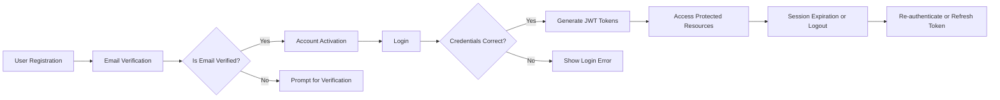

# User Roles and Authentication Requirements for Todo List Application

## User Role Definitions
The Todo List application shall support the following user roles:

### 1. user
- **Description:** A registered user who can authenticate, create, view, update, and delete their own todo items.
- **Responsibilities:**
  - Manage own todo items (create, view, edit, delete)
  - Access only personal data and actions
- **Restrictions:**
  - Cannot access other users' todo items
  - Cannot perform administration or moderation

### 2. admin
- **Description:** A system administrator who can manage user accounts and moderate todos (including deleting inappropriate content).
- **Responsibilities:**
  - Full access to all users' todo items
  - Can delete, modify, or moderate any todo
  - Manage user accounts (activate, deactivate, delete users)
- **Restrictions:**
  - Must not perform non-admin activities as a regular user unless system designates such duality explicitly.

## Authentication and Registration Flows
Authentication shall be mandatory for all users except where specified (such as registration or public onboarding). Authentication shall be based on JWT (JSON Web Tokens) and involve the following key processes:

### Registration (Sign Up)
- WHEN a prospective user submits a valid email and password, THE system SHALL create a user account and issue a verification email.
- IF registration input is invalid (email format failed, password too weak), THEN THE system SHALL reject the registration and return a clear, actionable error message.

### Login (Sign In)
- WHEN a user submits their registered email and password, THE system SHALL validate the credentials and issue JWT tokens (access and refresh).
- IF authentication fails (invalid credentials, deactivated user), THEN THE system SHALL return an authentication failure message.
- WHILE a user is authenticated, THE system SHALL allow access to authorized resources within permitted actions per role.

### Email Verification
- WHEN a new user registers, THE system SHALL send a verification email containing a unique link.
- WHEN the user confirms their email via the verification link, THE system SHALL activate the account and allow sign-in.
- IF unverified, THEN THE system SHALL restrict login and all privilege-granting actions.

### Password Reset
- WHEN a user initiates a password reset, THE system SHALL send a secure reset link to the user’s registered email.
- WHEN the user accesses the reset link and enters a valid new password, THE system SHALL update the password and notify the user.

### Logout
- WHEN a user requests logout, THE system SHALL invalidate the session token and prevent further access until the next login.

### Session Expiry
- WHEN a JWT access token expires, THE system SHALL reject requests and prompt the user to use a refresh token to renew the session or require re-authentication if the refresh token is expired.

### Multiple Devices
- WHERE a user logs in from multiple devices, THE system SHALL maintain separate sessions per device and allow users to revoke specific sessions.

## Role-based Access Control Models
Role-based permissions SHALL enforce the following control boundaries:

### user Role
- WHEN authenticated as user, THE system SHALL restrict data and operations to those owned or created by the authenticated user.
- IF a user attempts to access or modify data belonging to another user, THEN THE system SHALL deny access and log the attempt.

### admin Role
- WHEN authenticated as admin, THE system SHALL permit view, update, and delete operations on any user's todos, as well as user account management.
- WHEN admin performs moderation (e.g. deleting inappropriate todos), THE system SHALL log the action for compliance and auditing.

### General Access Rules
- THE system SHALL prohibit all unauthenticated access to any todo management or user data features.
- WHERE role elevation is attempted (user tries to act as admin), THE system SHALL reject the action.

## Permissions Matrix
| Action                        | user | admin |
|-------------------------------|:----:|:-----:|
| Register Account              | ✅   | ✅    |
| Login/Logout                  | ✅   | ✅    |
| Verify Email                  | ✅   | ✅    |
| Reset Password                | ✅   | ✅    |
| View Own Todos                | ✅   | ✅    |
| Create Todo                   | ✅   | ✅    |
| Edit Own Todo                 | ✅   | ✅    |
| Delete Own Todo               | ✅   | ✅    |
| View All Users' Todos         | ❌   | ✅    |
| Edit Any Todo                 | ❌   | ✅    |
| Delete Any Todo               | ❌   | ✅    |
| Manage User Accounts          | ❌   | ✅    |
| Moderate Inappropriate Todos  | ❌   | ✅    |

Legend: ✅ Permitted, ❌ Not Permitted

## Token Management and Session Policies
- THE system SHALL use JWT for both access tokens and refresh tokens in all authentication workflows.
- THE access token SHALL expire within 30 minutes of issuance.
- THE refresh token SHALL expire within 30 days of issuance.
- WHEN a token is revoked (e.g., manual logout or security incident), THE system SHALL immediately invalidate it and block further use.
- THE JWT payload for each token SHALL include: userId, role, issued-at (iat), expiration (exp), and a permissions array reflecting current role assignments.
- Sensitive operations (e.g., password reset, admin moderator actions) SHALL require a fresh access token validated within the last 5 minutes.
- Forceful session revocation SHALL be available for both self-initiation by users and admin-driven actions in the event of suspicious activity.

## Example Authentication Flow Diagram

## Security and Compliance Notes
- All authentication tokens SHALL be transmitted securely using HTTPS only.
- Tokens stored in httpOnly cookies or secure storage as recommended by best practice.
- Audit logs SHALL capture all authentication, session, and admin actions for compliance.
- THE system SHALL enforce rate limiting and lockout on repeated failed login attempts.

---

> *Developer Note: This document defines business requirements only. All technical implementations (architecture, APIs, database design, etc.) are at the discretion of the development team.*
