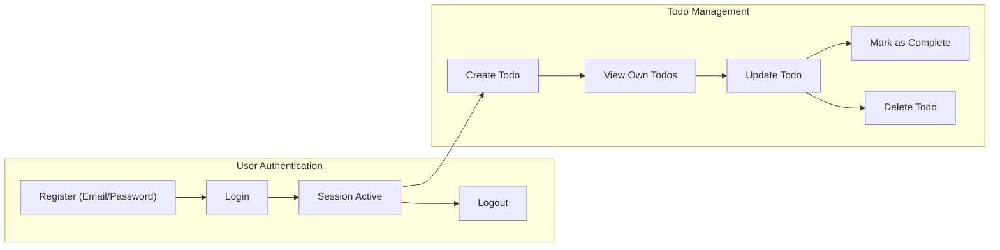

# Business Requirements for Todo List Application

This specification details all business requirements, workflows, user objectives, and foundational processes for a minimal yet robust todo management service supporting a single "user" role (no collaboration features). It is designed to be implementation-ready for backend development, using the EARS format for all requirements. All sections are complete, actionable, and free of vague language or technical implementation details such as schema or API.

## Feature List and Priorities

**Minimum Viable Feature Set**
- Account registration, login, password reset, session management.
- Todo creation by authenticated users.
- Secure viewing of all personal todos.
- Update (edit, mark as complete/incomplete), delete individual todos.
- Each todo visible and accessible only to its creator.

**Business Priorities**
- THE service SHALL ensure user privacy by segregating todos per user account.
- WHEN users perform todo actions, THE service SHALL provide immediate, unambiguous feedback for success, error, or validation failures.
- THE service SHALL minimize steps required to create, read, update, and delete todos for maximum productivity.

## Business Processes

### Account Lifecycle
- WHEN a user registers, THE system SHALL require a unique email address and a password that meets business minimums.
- WHEN a user logs in, THE system SHALL verify credentials and grant an authentication token if valid.
- WHEN a user requests a password reset, THE system SHALL require a registered email and SHALL send a reset link via email.
- WHEN a user logs out, THE system SHALL invalidate their authentication session.
- WHEN a user is inactive for 30 days, THE system SHALL expire their session.

### Todo Item Lifecycle
- WHEN an authenticated user creates a todo, THE system SHALL require a non-empty title (1–255 chars), optional description, and mark status as "incomplete" by default.
- WHEN a todo is created, THE system SHALL record created and last-modified timestamps in ISO 8601 UTC format.
- WHEN a user lists todos, THE system SHALL display their own todos only, sorted by most recent creation.
- WHEN a user updates a todo, THE system SHALL allow updates to title, description, and "completed" status; all changes timestamped.
- IF a user attempts to delete a todo, THEN THE system SHALL confirm ownership and irreversibly remove it, with instant response.
- IF a user attempts access to another user's todo, THEN THE system SHALL deny the action and log the attempt for security review.
- WHEN a user exceeds 500 todos, THE system SHALL prevent creation of new todos and SHALL return an error message explaining the maximum is reached.
- WHEN marking a todo complete, THE system SHALL add a timestamp for when completion occurred.

## Non-functional Requirements

- THE system SHALL process all todo operations (CRUD) and respond within 2 seconds 95% of the time under standard loads (≤500 todos per user).
- THE system SHALL maintain 99.9% uptime for all auth and todo features, excluding pre-announced maintenance windows.
- THE system SHALL store passwords using business-approved, cryptographically secure salted hashing.
- THE system SHALL prevent any user from accessing another user's data or account details.
- THE system SHALL restrict todo and account access to the authenticated user only.
- THE system SHALL treat every add, update, or delete operation as an atomic, all-or-nothing business transaction.
- THE system SHALL enforce all field-level validation rules strictly: todo title required, 1–255 chars max, description optional, timestamps accurate.

## Business Rules

- THE system SHALL require authentication for all todo-related operations; no guest or unauthenticated actions permitted.
- THE system SHALL never reveal the existence of unauthorized resource IDs in error messages (e.g., another user's todo).
- WHEN a password reset, email update, or login failure occurs, THE system SHALL provide only generic error messages to prevent disclosure of private information.
- IF validation fails (e.g., field too long, not present), THEN THE system SHALL return a validation error specifying the field and rule violated.
- THE system SHALL allow deletion of any user-owned todo irreversibly; deleted todos are purged and unrecoverable.
- THE system SHALL not expose any collaboration features or shared lists.
- THE system SHALL enforce per-user isolation such that only the creator can access their todos.
- WHEN a user deletes their account, THE system SHALL permanently remove all associated todos and account data (with any regulatory hold period observed by business policy).
- THE system SHALL permit a user to change account email with verification; pending email changes prevent login until confirmed.

## Mermaid Diagram: Todo Core Business Workflow

## Related Documents
- For detailed authentication logic and session flows, see the [Authentication and Roles Requirements](./05-authentication-and-roles.md).
- For user-facing error and edge case handling, reference [Error Handling and User Guidance](./07-error-handling.md).
- For uptime, security, and system operational standards, consult [Non-Functional Requirements](./08-nonfunctional-requirements.md).

## Implementation Note

This requirements analysis specifies business objectives and rules only. All technical implementation decisions—including storage, APIs, database, and technology—are at the exclusive discretion of the development team.