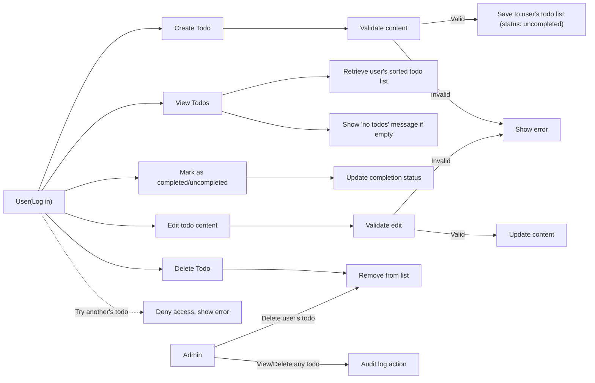

# Functional Requirements for Minimal Todo List Application

## Scope of Application
This document defines all business-level requirements for a minimal Todo list application. The requirements cover the core functionality needed for users to manage their personal task lists and for administrators to fulfill operational duties. No technical or implementation details are included—only the business processes and constraints are described, using EARS format for all actionable requirements.

## Core Features

### Add Task/Todo
- WHEN a user submits a valid todo item, THE system SHALL save the todo to that user's personal list.
- IF a user submits an empty or whitespace-only todo, THEN THE system SHALL reject the submission and present an appropriate error message.

### View Task List
- WHEN a user requests to view their todo list, THE system SHALL display all todos belonging to that user in creation order, most recent first.
- WHERE todos exist for a user, THE system SHALL provide a means for the user to distinguish completed from uncompleted tasks (e.g., visual indicator).

### Mark Task as Completed
- WHEN a user marks any of their todos as completed, THE system SHALL update the completion status of the selected task to "completed" without altering other fields.
- WHEN a user marks any completed todo as uncompleted, THE system SHALL update the status to "uncompleted" only for the selected task.

### Edit Task Content
- WHEN a user edits the content of an existing todo, THE system SHALL update only the content field of that todo, provided the new content passes validation.
- IF a user tries to edit a todo with empty or invalid content, THEN THE system SHALL reject the change and provide an error message.

### Delete Task
- WHEN a user deletes a todo they own, THE system SHALL permanently remove that todo from the user's list.

## Business Logic Rules

### Ownership and Access
- THE system SHALL restrict access so that only the creator of a todo can view, edit, or delete that task, except for admin users.
- WHEN an admin views any user's todos, THE system SHALL grant access for administrative purposes but require clear logging of this action.
- WHEN an admin deletes a user's todo, THE system SHALL remove the todo and log the operation for audit purposes.

### Task Content Rules
- THE system SHALL enforce a maximum length of 255 characters for each todo's content.
- IF content exceeds 255 characters, THEN THE system SHALL reject the todo with a relevant error message.

### Status Defaults and Changes
- WHEN a todo is created, THE system SHALL set its status to "uncompleted" by default.
- WHEN a todo is successfully deleted, THE system SHALL remove all references to that todo in the user's active list.

## Task and List Management

### List Retrieval and Filtering
- WHEN a user requests their todo list, THE system SHALL return all their todos, ordered with the most recently created tasks first.
- WHERE many todos exist, THE system SHALL support paginated listing of tasks with a default page size of 20.

### Bulk Operations (Optional Minimalism)
- WHERE business requirements call for absolute minimalism, THE system SHALL NOT permit bulk operations on tasks (such as mass deletion or mark all as complete) at MVP stage.

## Edge Cases and Exceptions

### Invalid or Unauthorized Actions
- IF a user attempts to view, edit, or delete a todo that does not exist or that belongs to another user, THEN THE system SHALL deny the operation and give a clear error notification.
- IF an unauthenticated user (not logged in) attempts to access todo-related functions, THEN THE system SHALL require authentication before proceeding.
- IF an admin performs any action affecting another user's todos, THEN THE system SHALL create an audit log entry with time, admin username, and action details.

### Empty List Handling
- IF a user has no todos, THEN THE system SHALL display a message indicating the list is empty.

### Input Validation
- THE system SHALL enforce that each todo must have non-empty, non-whitespace content and must not contain control characters.

## Success Criteria
- WHEN all requirements described above are implemented and verifiable by business tests, THE system SHALL be considered compliant with minimal functional requirements.
- THE system SHALL pass all acceptance tests for the following scenarios without error:
  - Adding, viewing, editing, deleting a todo for a user
  - Marking tasks as completed/uncompleted
  - Preventing access to todos by unauthorized users
  - Enforcing business rules on content length and validation
  - Admin actions on user data are logged correctly
- THE system SHALL respond to all business operations (create, read, update, delete, mark complete) within 2 seconds for user-perceived performance.

## Visual Flow (Mermaid Diagram)

