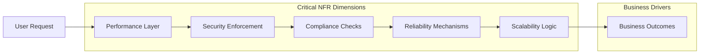

# Non-Functional Requirements for Todo List Application

## Performance Criteria
- THE service SHALL respond to all standard API operations (create, read, update, delete Todo) within 1 second under normal load (fewer than 1,000 concurrent users).
- WHEN a user loads their Todo list, THE system SHALL return a complete list within 1 second, unless the user has over 5,000 items.
- IF a user has over 5,000 Todos, THEN THE system SHALL return the first 100 Todos in 1 second and provide mechanisms to request more.
- THE system SHALL support at least 2,000 total concurrent users, scaling to 10,000 with performance degradation not to exceed 30% increase in average response time.
- THE system SHALL be available 24/7 except for scheduled maintenance, with notification provided at least 48 hours in advance.

## Security Requirements
- THE service SHALL require HTTPS/TLS encryption for all client-server communications, without exception.
- WHEN users register, log in, or reset passwords, THE system SHALL enforce input validation and sanitization to prevent injection attacks (XSS, SQL Injection, etc.).
- THE system SHALL store all user credentials using salted, strong one-way hashing algorithms (e.g., bcrypt, argon2).
- THE service SHALL use JWT (JSON Web Tokens) for authentication, with access tokens expiring within 30 minutes and refresh tokens no longer than 30 days.
- WHEN an admin accesses or deletes another user's Todo, THE system SHALL log this action with a timestamp, role, and affected resource.
- WHERE multiple failed login attempts occur (more than 5 within 10 minutes), THE system SHALL temporarily block further attempts from that source for 15 minutes and log the event.
- THE service SHALL prevent unauthenticated or unauthorized users from accessing, modifying, or viewing any data not permitted by their role (as defined in [User Roles and Authentication](./02-user-roles-and-authentication.md)).
- IF a security breach is detected (including data access outside user scope), THEN THE service SHALL notify an admin within 15 minutes and restrict further suspicious activity.

## Compliance Mandates
- THE service SHALL comply with all relevant data protection laws and regulations applicable to the service’s jurisdiction (e.g., GDPR, CCPA if service operates in those regions).
- THE system SHALL provide means for users to request the deletion of their data, and deletion SHALL occur within 30 days of the request, with user notification upon completion.
- WHERE data is retained for operational or legal purposes, THE system SHALL clearly inform users during account registration (linking to the [Privacy and Data Protection Policy](./09-privacy-and-data-protection.md)).
- WHEN processing or storing sensitive information (such as authentication credentials), THE service SHALL use practices consistent with ISO/IEC 27001 recommendations.

## Reliability and Availability
- THE service SHALL achieve an uptime of at least 99.5% measured monthly, excluding scheduled downtime with advance notice.
- WHEN a critical system failure occurs (e.g., total outage, database corruption), THEN THE system SHALL notify admins within 5 minutes and provide a status update every 30 minutes until resolved.
- THE service SHALL perform and verify daily data backups, storing copies in at least two physically separate locations.
- WHEN a user performs a successful write operation (create, update, delete), THE system SHALL confirm the operation and ensure that the result persists across service restarts.
- IF a user’s action fails due to backend error, THEN THE system SHALL respond with a clear error message and not result in data loss or inconsistency.

## Scalability Considerations
- THE service SHALL be designed to handle user base growth from 100 to at least 50,000 registered users without requiring fundamental system redesign.
- THE system SHALL scale horizontal capacity (i.e., add more servers) for API endpoints, authentication, and storage when usage exceeds 80% sustained capacity for more than 1 hour.
- WHEN increased demand is observed, THE system SHALL degrade gracefully by prioritizing core API responses (listing, reading, updating Todos) and may defer lower-priority operations (analytics, logs compaction) until demand subsides.
- WHERE load spikes exceed currently provisioned resources, THE system SHALL maintain at least read access for all active users, even if some write operations must be temporarily throttled.

## Visual Overview: System NFR Relationships

All requirements above are written solely as business-driven minimum guarantees; technical implementation details are left to the discretion of the development team.