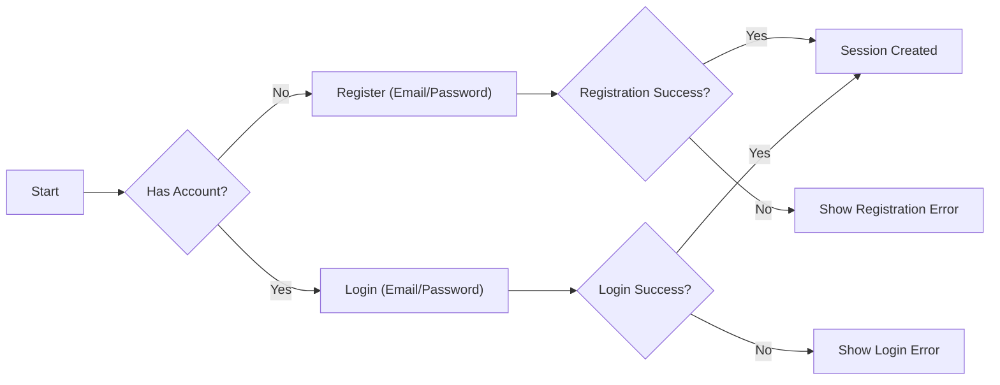
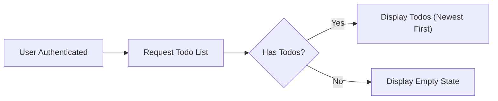
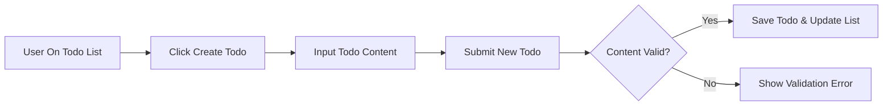
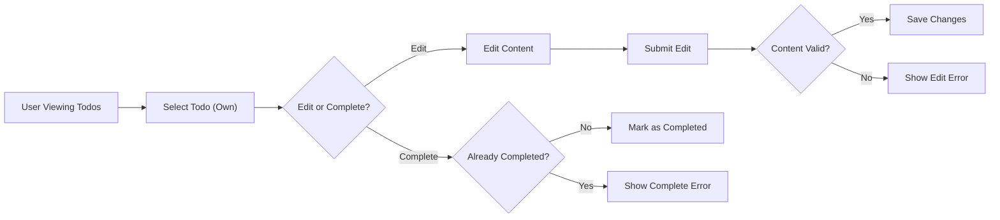
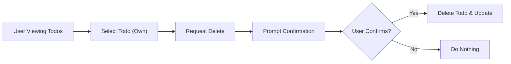

# User Journey and Flow Specification for Minimal Todo List Application

## Introduction
This document presents the complete user journeys, covering all business flows of the minimal Todo list application. The scope is strictly limited to a single-user system—each authenticated user manages only their own todos. All requirements and flows are described in natural language, using EARS format wherever applicable, and illustrated with Mermaid diagrams (with all labels in double quotes).

---

## Core User Flows

### 1. Account Registration and Login
- User navigates to the application and chooses to register or log in.
- Registration requires a unique email and password. Upon success, the user is authenticated and a session is started.
- Login requires the previously registered email and password. On success, the session is established. Failed attempts are handled gracefully.

#### Mermaid: Registration & Login

### 2. Viewing All Todos
- Upon authentication, users are presented with their complete, personal todo list.
- Todos are always displayed in most-recent-first order.
- No todos? An empty state is shown.

#### EARS Requirements
- WHEN user is authenticated, THE system SHALL display that user’s todo list ordered by most recent first.
- IF user has no todos, THEN THE system SHALL display an empty list view.
- THE system SHALL restrict the visibility of todos such that only their owner can view them.

#### Mermaid: View Todos

### 3. Create New Todo Item
- User submits a new todo item (task description required; due date optional).
- The todo is added to their list and stored securely.
- Validation ensures empty content cannot be submitted.

#### EARS Requirements
- WHEN user submits new todo item, THE system SHALL validate the input (task description required; due date optional).
- IF validation passes, THEN THE system SHALL save the new todo item and update the display instantly.
- IF validation fails (e.g., empty content), THEN THE system SHALL display a specific validation error message.

#### Mermaid: Create Todo

### 4. Update/Complete Todo Item
- User selects a todo and edits its content or marks it completed.
- Only uncompleted todos may be marked complete.
- Validation prevents creating empty content on update.

#### EARS Requirements
- WHEN user updates a todo, THE system SHALL validate the new content as non-empty.
- WHEN user marks a todo as complete, THE system SHALL update the todo’s status to completed.
- THE system SHALL prevent marking already completed todos again.
- IF validation fails during update, THEN THE system SHALL show a specific error.

#### Mermaid: Edit/Complete Todo

### 5. Delete Single Todo Item
- User chooses to delete one of their own todos.
- System prompts for confirmation before deletion.
- On confirmation, the todo is removed; otherwise, no action.

#### EARS Requirements
- WHEN user requests deletion of a todo, THE system SHALL display a confirmation prompt.
- IF user confirms, THEN THE system SHALL remove the todo and update the list.
- IF user cancels, THEN THE system SHALL take no action.
- THE system SHALL prevent deletion of todos that do not belong to the user.

#### Mermaid: Delete Single Todo

### 6. Bulk Complete/Delete
- User may select multiple todos and either mark them as complete or delete them, with similar validation, confirmation, and error handling logic as single-item operations.

#### EARS Requirements
- WHEN user selects multiple todos and requests an action, THE system SHALL validate that all selected todos belong to the user and are eligible for the action (cannot re-complete completed items).
- WHEN action is confirmed, THE system SHALL perform the specified action on all selected items and update the list immediately.
- IF any selected todo cannot be processed (e.g., already deleted, not owned by user), THEN THE system SHALL show an error and skip that item in the bulk action.

---

## Entry and Exit Points

### Entry Points
- Initial entry: Application access starts with registration or login.
- Re-entry: Authenticated users returning after a session expiry must log in again.
- Session tokens are required for all user actions.

### Exit Points
- User explicitly logs out: Session is terminated and all protected data is inaccessible.
- Session expires due to inactivity: User is automatically logged out and notified.

#### EARS Requirements
- WHEN user logs out, THE system SHALL terminate the session and require re-authentication for further access.
- WHEN session expires, THE system SHALL notify the user and redirect to the login screen.

---

## Edge Cases and Alternate Scenarios

### 1. Validation Failures
- IF user submits empty or invalid todo data, THEN THE system SHALL explicitly reject the action and display a validation error.

### 2. Unauthorized Actions
- IF user tries to view, edit, or delete another user’s todos (not possible in UI, but must be enforced at business logic), THEN THE system SHALL deny the action and display an error.

### 3. Session Timeout
- IF user’s session expires, THEN THE system SHALL immediately revoke access to all todo operations and prompt re-authentication.

### 4. Server/Network Errors
- IF any business action cannot complete due to backend/server/network errors, THEN THE system SHALL display a generic error and advise the user to retry.

----

## Summary Table: Major User Flows
| Flow                          | Trigger/Event   | Outcome                                         | Error Handling                |
|-------------------------------|-----------------|--------------------------------------------------|-------------------------------|
| Register new account          | User chooses    | Session created; redirected to todo list         | Show error if email exists    |
| Login                         | User chooses    | Session created; user’s todos displayed          | Show invalid credential error |
| View todos                    | Login/session   | Display ordered todo list                        | Show empty list if none       |
| Create todo                   | User submits    | Todolist updated instantly; item on list         | Input validation error        |
| Edit/complete todo            | User edits      | Changes saved, todo updated in place             | Input or logic error          |
| Delete todo                   | User confirms   | Todo removed from list                           | None (user cancels action)    |
| Bulk complete/delete          | User selects    | Bulk action applies to eligible items            | Show skipped items/error      |
| Logout/expire                 | User/session    | Session ends, must re-authenticate               | N/A                           |

----

## Notes
- All flows are scoped for a minimally-functioning Todo list, single-user per account, with no multi-user or admin logic.
- All actions MUST complete instantly from the user’s perspective, with any delays or errors promptly and specifically messaged according to above rules.
- Error and edge case handling is a first-class business requirement, not optional cleanup logic.

