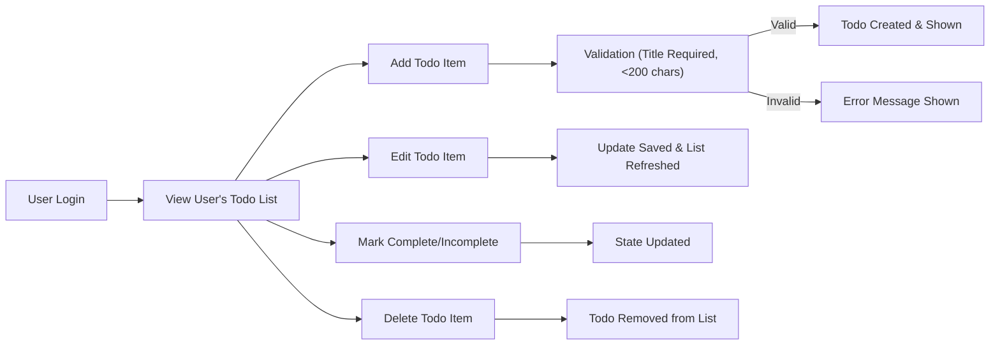
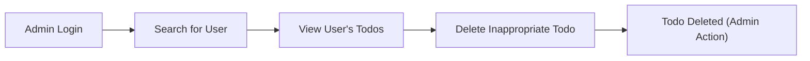

# User Scenarios and Use Cases for Todo List Application

## 1. Introduction
### Purpose of This Document
This document details typical and edge-case user scenarios for the Todo List application. Its purpose is to provide backend developers with precise, actionable business logic and acceptance criteria using EARS format where applicable. It ensures that technical implementation accurately reflects real-world user interactions, expectations, and outcomes.

### Coverage and Scope
This document covers all minimal viable user actions related to todo management, including both standard and exceptional user flows, across all supported roles: user and admin.

## 2. Primary Usage Scenarios

### 2.1. Standard User: Manage Todos
- Scenario: A registered user manages their personal todo list day-to-day.
- Workflow:
  1. Sign in to the application.
  2. View all personal todo items listed in reverse chronological order.
  3. Add a new todo item by specifying title (required) and optional description.
  4. Edit existing todo content.
  5. Mark a todo as completed or incomplete.
  6. Delete a todo item.

#### Acceptance Criteria (EARS):
- THE system SHALL display to the user all todo items they have created, sorted with the most recent first.
- WHEN the user submits a new todo item with a non-empty title, THE system SHALL add the todo to their list and make it immediately visible.
- WHEN the user provides an empty title, THEN THE system SHALL reject the todo and respond with an error message indicating that a title is required.
- WHEN the user edits a todo, THE system SHALL update and show the revised content immediately.
- WHEN the user marks a todo as complete/incomplete, THE system SHALL persist and display the updated status.
- WHEN the user deletes a todo, THE system SHALL remove it from their list instantly.
- THE system SHALL restrict visibility to only the user's own todos. Users cannot see or modify others' todos.

### 2.2. Admin: Manage Users and Moderate Todos
- Scenario: An admin oversees all user activity and enforces proper usage.
- Workflow:
  1. Sign in as admin.
  2. Search and review any user's todos.
  3. Delete inappropriate or flagged todo items as needed.
  4. Manage user accounts (e.g., disable, reactivate).

#### Acceptance Criteria (EARS):
- WHERE the signed in user is an admin, THE system SHALL allow viewing and deleting any todo item.
- WHERE the signed in user is an admin, THE system SHALL allow searching for any user by identifier.
- WHEN an admin deletes a todo, THE system SHALL remove it globally and annotate the removal as admin action.
- WHEN an admin disables a user, THE system SHALL revoke their access immediately.

## 3. Alternative/Edge Case Scenarios

### 3.1. Input Validation and Empty States
- Scenario: User tries to create a todo with missing information, or performs actions on empty lists.
  - IF the user submits a todo with title longer than 200 characters, THEN THE system SHALL reject the input and return a validation error for title length.
  - IF the user views the todo list when it is empty, THEN THE system SHALL display a message stating no todos are present.

### 3.2. Unauthorized Access or Permission Errors
- Scenario: User or guest attempts to access or modify resources outside their permissions.
  - IF a user attempts to view or manipulate another user's todos, THEN THE system SHALL deny access and show a permission denied error.
  - IF a non-admin attempts admin functions, THEN THE system SHALL deny access and return an unauthorized error.

### 3.3. Maximum Item and Rate Limits
- Scenario: User attempts to exceed system-imposed limits (if any, e.g., 100 active todos per user).
  - IF a user creates more than 100 active todos, THEN THE system SHALL reject the action and return an error stating the limit is reached.

### 3.4. Data Loss or Session Timeout
- Scenario: User loses work due to session expiration or network failure.
  - IF the session expires while working, THEN THE system SHALL prompt for re-authentication and preserve unsaved input where possible.

## 4. User Goals and Outcomes

### 4.1. User Role
- Goal: Efficient self-management of personal tasks. Users must be able to manage their own todos easily without interference.
- Outcome: Users complete their workflows (add, update, complete, delete todos) quickly and reliably.

### 4.2. Admin Role
- Goal: Ensure system remains free from abuse and inappropriate content. Manage users and their data when necessary.
- Outcome: Admins can rapidly respond to moderation needs and manage user accounts with minimal friction.

## 5. Scenario-based Acceptance Criteria (EARS)

#### Create Todo
- WHEN a user provides valid title for a new todo, THE system SHALL add it to the user's todo list and confirm success.
- IF the title is missing or too long, THEN THE system SHALL reject the request with appropriate error message.

#### Edit Todo
- WHEN a user edits the text of a todo they own, THE system SHALL update the todo with the new information and reflect changes instantly.

#### Mark Complete/Incomplete
- WHEN a user toggles completion status, THE system SHALL persist the updated state and make it visible.

#### Delete Todo
- WHEN a user requests to delete their own todo, THE system SHALL remove it and confirm removal.
- WHEN an admin deletes a todo, THE system SHALL remove it and log the admin action.

#### Permission Violations
- IF a user attempts to access or edit todos not owned by them, THEN THE system SHALL deny the action and report a permission error.
- IF a non-admin attempts admin actions, THEN THE system SHALL reject the action with an unauthorized error.

#### Maximum Todo Items (if enforced)
- WHEN a user has reached the maximum allowed active todos, THE system SHALL block further creation and describe the reason.

## 6. Mermaid Diagrams

Below is a core user flow for primary user scenario:

Admin main scenario:

