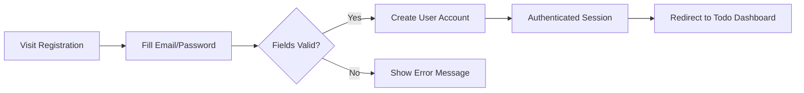
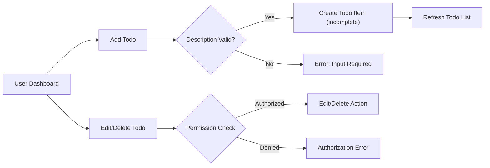
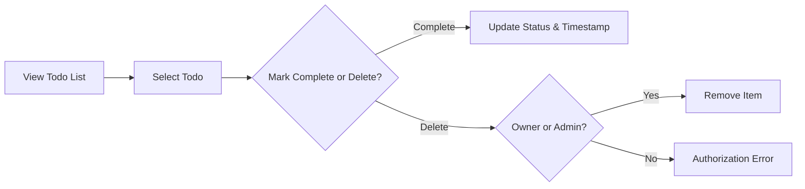
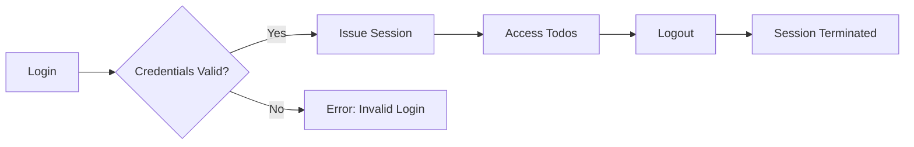

# User Journey and Workflows for Todo List Application

## 1. Introduction
This document outlines the step-by-step end-user journeys and core workflows for all major features of the Todo List application. All scenarios are described from a business requirements perspective for backend developers. No technical implementation details are included. Requirements are written in natural language and, where possible, use the EARS format for clarity and precision. Mermaid diagrams are included for visual workflow understanding, using proper double quoting in all node labels.

---

## 2. User Registration and Onboarding

### 2.1. Standard User Registration
- WHEN a visitor wants to use the service, THE system SHALL require registration with a unique email and password.
- WHEN the user submits registration details, THE system SHALL validate email format and the presence of a password.
- IF any field is missing or invalid, THEN THE system SHALL reject the registration and inform the user of the issue.
- WHEN the email is unique and the input valid, THE system SHALL create a new 'user' account and initiate a user session.
- WHERE email verification is enabled (see [User Roles and Authentication](./02-user-roles-and-authentication.md)), THE system SHALL send a verification link to the user's email address.
- WHEN the account is created, THE system SHALL redirect the user to their personal dashboard or todo list view as onboarding.

### 2.2. Registration Constraints
- THE system SHALL ensure no duplicate emails exist in the user database.
- WHEN a user attempts to register with an email used by another account, THE system SHALL present an error message and prevent account creation.
- THE system SHALL enforce policy that passwords meet minimum length and security criteria.

---

## 3. Adding and Managing Todos

### 3.1. Creating a Todo
- WHEN an authenticated user submits a new todo, THE system SHALL require non-empty description text, up to 255 characters.
- IF a user submits an empty or overlong description, THEN THE system SHALL reject the input and return a validation error message.
- WHEN description is valid, THE system SHALL add the todo to the user's personal list, with status set to incomplete on creation.

### 3.2. Viewing Todos
- WHEN a user accesses their dashboard, THE system SHALL show all todos owned by the user, sorted newest first.
- WHERE a user wants to filter todos by status, THE system SHALL support filtering by completed and incomplete status.

### 3.3. Editing Todos
- WHEN a user edits the text of an existing todo they own, THE system SHALL require the new description to be valid (not empty, less than 256 characters).
- IF a user attempts to edit a todo they do NOT own, THEN THE system SHALL deny the request and provide an authorization error.

### 3.4. Changing Status
- WHEN a user marks a todo as complete, THE system SHALL update the item status and record a completion timestamp.
- WHEN a user marks a completed todo as incomplete, THE system SHALL clear the completion timestamp.

### 3.5. Deleting Todos
- WHEN a user deletes their own todo, THE system SHALL remove it permanently.
- IF a user attempts to delete a todo not owned by them, THEN THE system SHALL deny deletion and display an error.
- WHERE an admin acts, THE system SHALL allow them to delete any todo for moderation, logging the event for audit.

---

## 4. Completing and Deleting Todos

- WHEN a user marks a todo as complete or incomplete, THE system SHALL immediately update the todo's status and associated timestamp as applicable.
- WHEN a user deletes a todo, THE system SHALL perform a hard deletion from their view and system storage.
- WHEN an admin deletes a todo, THE system SHALL log the action and notify the owning user per business policy.

---

## 5. Session Management and Logout

### 5.1. Login
- WHEN users submit valid login credentials, THE system SHALL authenticate and start a session.
- IF login fails due to invalid email or password, THEN THE system SHALL display a generic error and not specify which field is invalid.

### 5.2. Logout
- WHEN a user requests logout, THE system SHALL immediately terminate their current authentication session and invalidate any active tokens.

### 5.3. Session Lifetime
- THE system SHALL automatically expire sessions after a predetermined interval of inactivity (see [User Roles and Authentication](./02-user-roles-and-authentication.md)).
- IF an admin deactivates a user account, THEN THE system SHALL revoke all active sessions for that user instantly.

---

## 6. Workflow Diagrams (Mermaid)

### 6.1. User Registration & Onboarding

---

### 6.2. Adding & Managing Todos

---

### 6.3. Completing & Deleting Todos

---

### 6.4. Session Management & Logout

---

## 7. Generic Workflow by Role

### 7.1. Registered User
- THE registered user SHALL be able to register, login, add, edit, complete, and delete their own todos.
- IF a registered user attempts to modify or delete someone else’s todo, THEN THE system SHALL deny the action with a permission error message.

### 7.2. Admin
- THE admin SHALL be able to perform all actions available to registered users.
- THE admin SHALL be able to delete or edit any user’s todo for moderation purposes.
- WHEN an admin deactivates a user, THE system SHALL instantly terminate that user’s session(s).
- WHEN an admin deletes a todo not owned by themselves, THE system SHALL record the event for audit.

---

## 8. Developer Autonomy Statement
> Developer Note: This document defines business requirements only. All technical implementations (architecture, APIs, database design, etc.) are at the discretion of the development team. This document specifies WHAT the system must do; HOW to build it is left to backend developers.
