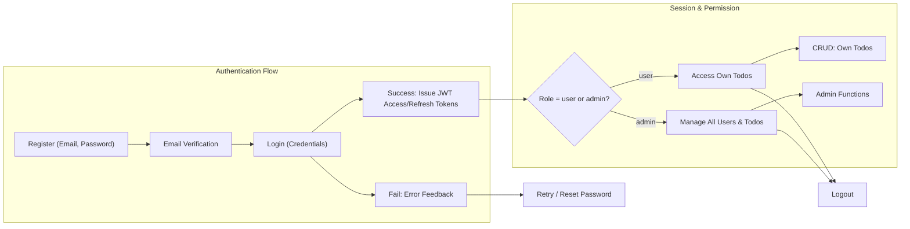

# User Roles, Permissions, Authentication & Authorization Requirements

## Authentication Requirements

### Core Authentication Functions
- THE system SHALL allow new users to register their account with an email and password.
- THE system SHALL require user registration and verified email prior to granting persistent access to core features.
- WHEN a user submits login credentials, THE system SHALL authenticate the user by validating credentials against registered data.
- WHEN a user successfully authenticates, THE system SHALL issue a new JWT access token and refresh token for session management.
- THE system SHALL allow users to log out, invalidating their active session and tokens.
- WHEN a user requests a password reset, THE system SHALL provide a secure password reset mechanism via email.
- WHEN a user changes their password, THE system SHALL require re-authentication with the current valid password, and invalidate all prior sessions.
- WHEN a user requests email verification, THE system SHALL send a verification code or link to the registered email.
- IF login attempts fail due to incorrect credentials, THEN THE system SHALL reject access and display a clear error message, without revealing which field was incorrect.
- IF a user's access token is expired, THEN THE system SHALL require use of a valid refresh token for session renewal, else prompt for re-login.
- THE system SHALL securely manage all user sessions, supporting single-login per device and allowing session revocation.
- WHEN an admin performs maintenance or emergency account recovery, THE system SHALL log all such activities and require two-factor confirmation if supported by business procedures.

## Role Hierarchy & Permissions

### Role Definitions
| Role  | Description |
|-------|-------------|
| user  | A registered user who can manage only their own Todo list and related tasks. Cannot access or modify any other user's data. |
| admin | An administrator who can manage all users and todos across the system, and perform emergency recovery/maintenance actions. |

### Role-based Business Requirements
- WHERE a person is not authenticated, THE system SHALL prevent all access to any Todo-related operations except registration, login, and password reset.
- WHERE a user is authenticated as 'user', THE system SHALL allow full CRUD operations (create, read, update, delete) only on that user's own Todo items.
- WHERE a user is authenticated as 'user', THE system SHALL prevent any access to other users' data, todos, or profiles.
- WHERE a user is authenticated as 'admin', THE system SHALL allow view, update, or deletion of any user's todos and user management operations.
- WHERE a user is authenticated as 'admin', THE system SHALL allow viewing of system logs, activity trails, and execution of system-level recovery or maintenance features.
- WHEN an action is attempted that is outside the current user's role, THEN THE system SHALL reject the action and display a clear, non-specific error message (e.g., "You do not have permission to perform this action.").

### Edge Cases and Restrictions
- IF a 'user' attempts to escalate privilege or access admin functions, THEN THE system SHALL log the attempt and block the operation.
- IF an 'admin' attempts to delete their own admin account, THEN THE system SHALL reject the operation to preserve at least one system administrator.

## Token & Session Management

### Token Strategy
- THE system SHALL use JWT (JSON Web Tokens) for user authentication and session management.
- JWT access tokens SHALL have a short expiration period (15–30 minutes recommended), after which users must provide a refresh token or re-authenticate.
- JWT refresh tokens SHALL have a longer expiration period (7–30 days recommended), and may be invalidated upon logout or password change.
- THE system SHALL store tokens securely, either in localStorage (for user convenience) or via secure httpOnly cookies (for enhanced security, as business needs dictate).
- Each JWT issued SHALL contain at minimum: userId, user role, a permissions array matching that role, token expiration timestamp, unique token signature.
- THE system SHALL securely manage secret keys for signing JWTs, implementing rotation policies as dictated by organizational security practices.
- WHEN a user's session expires or tokens are revoked/invalid, THE system SHALL require re-authentication.

### Session Management Business Logic
- THE system SHALL support explicit logout to immediately invalidate session and tokens.
- THE system SHALL allow users to review and revoke any device’s session, requiring token invalidation and re-login from that device.
- WHEN a password is changed, THE system SHALL expire all currently active access and refresh tokens for that user.

## Permission Matrix

| Business Action          | user | admin |
|-------------------------|------|-------|
| Register account        | ✅   | ✅    |
| Login                   | ✅   | ✅    |
| Logout                  | ✅   | ✅    |
| Password reset          | ✅   | ✅    |
| Create own Todo         | ✅   | ✅    |
| Read own Todo           | ✅   | ✅    |
| Update own Todo         | ✅   | ✅    |
| Delete own Todo         | ✅   | ✅    |
| Read others’ Todos      | ❌   | ✅    |
| Update others’ Todos    | ❌   | ✅    |
| Delete others’ Todos    | ❌   | ✅    |
| View user list          | ❌   | ✅    |
| Update user roles       | ❌   | ✅    |
| Delete user account     | ❌   | ✅    |
| Emergency recovery      | ❌   | ✅    |
| System maintenance      | ❌   | ✅    |

### EARS-based Requirements for Permissions
- WHEN a user with 'user' role requests Todo creation, reading, updating, or deletion, THE system SHALL ensure these actions affect only their own data.
- IF a user with 'user' role requests access to other users’ information or tasks, THEN THE system SHALL deny the request and log the incident.
- WHEN a user with 'admin' role requests access to any user’s Todos, THE system SHALL grant that access.
- WHEN a user with 'admin' role performs user management, THE system SHALL require audit logging of all such actions.

## Mermaid Diagram – Authentication & Authorization Flows

## Error Scenarios (Selection)
- IF any authentication token is missing, expired, or invalid, THEN THE system SHALL block all access except login/registration/password reset.
- IF a user repeatedly fails logins (e.g., 5 failed attempts in 10 minutes), THEN THE system SHALL lock the account temporarily and require further identity proof to unlock.
- IF session or device is not recognized after password reset, THEN THE system SHALL require re-authentication.

## Business Requirements Only

> *Developer Note: This document defines business requirements only. All technical implementations (architecture, APIs, database design, etc.) are at the discretion of the development team.*
