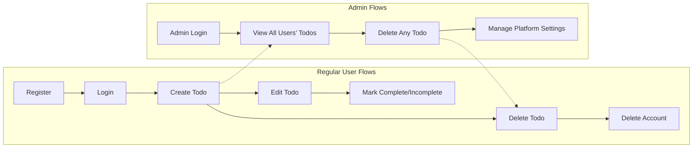

# User Stories for Minimal Todo List Application

## Persona Overview

### Registered User ("user" role)
A regular member who registers to use the service to organize personal tasks. Seeks simplicity, privacy, fast access, and full control over their task data. Pain points include forgetting critical tasks, not being able to find or modify todos quickly, and risk of accidental data loss.

### Administrator ("admin" role)
Manages the overall health and operation of the Todo list platform, including resolving user issues or misuse. Focused on ensuring system integrity, privacy, and minimal friction for daily users. Needs clear oversight tools and the power to resolve business-impacting situations (e.g., data misuse or objectionable content in todos).

## Primary Scenarios

### 1. User Registers and Becomes Productive
- WHEN a new visitor wants to use the todo list, THE system SHALL allow registration using email and password.
- WHEN registration succeeds, THE system SHALL allow immediate creation of the first todo item.
- WHEN logged in, THE user SHALL access a personal list of todos.

### 2. Creating, Viewing, and Editing Todos
- WHEN a user is authenticated, THE system SHALL allow the creation of a new todo item with a title and optional description.
- WHEN a user views their list, THE system SHALL display all current todos, sorted by creation or due date.
- WHEN a user edits a todo, THE system SHALL update the task and display the change instantly in the user's list.

### 3. Marking Todos as Complete or Incomplete
- WHEN a user marks a todo as complete, THE system SHALL reflect this status in the user's personal task list.
- WHEN a completed todo is unchecked, THE system SHALL revert its status to incomplete and show the update immediately.

### 4. Deleting Todos
- WHEN a user deletes a todo, THE system SHALL permanently remove the task from the user's accessible list.
- WHEN a user requests deletion, THE system SHALL display a confirmation step to prevent accidental loss.

### 5. Admin Oversight and Intervention
- WHEN an admin logs in, THE system SHALL provide a dashboard or access to all users' todos.
- WHEN an admin identifies misuse (e.g., offensive content), THE system SHALL allow the admin to delete inappropriate todos.
- WHEN platform-wide settings need adjustment, THE system SHALL enable admins to make and save operational changes instantly.

## Secondary Scenarios

### 6. Password Management
- WHEN a user forgets their password, THE system SHALL provide a secure password reset flow via email.
- WHEN a user wants to change their password, THE system SHALL validate and update securely.

### 7. Session Management
- WHEN a user logs out, THE system SHALL terminate the session and restrict access to todos until re-authentication.
- WHEN a user is inactive for a prolonged period, THE system SHALL expire the session as per business policy and require login again.

### 8. Bulk Operations
- WHEN a user wishes to delete multiple todos at once, THE system SHALL support selection and batch removal with a single confirmation step.
- WHEN a user desires to mark all tasks as complete, THE system SHALL perform this action efficiently and update the state for each task.

### 9. Data Privacy Actions
- WHEN a user wishes to delete their account, THE system SHALL provide a clear process, erase the user's todos, and confirm the operation to the user.

## Failure and Exception Scenarios

### 10. Invalid Actions and Error Handling
- IF a user attempts to view, edit, or delete a todo they do not own, THEN THE system SHALL deny the action and return an appropriate error message.
- IF a user tries to create a todo with missing required fields (e.g., no title), THEN THE system SHALL show a validation error and block submission.
- IF the backend is temporarily unavailable, THEN THE system SHALL inform users of the issue and suggest retrying later, without data loss.
- IF an admin tries to access removed or non-existent todos, THEN THE system SHALL display an error and prevent undefined system behavior.

### 11. Security and Privacy Violations
- IF a user or admin attempts to bypass authentication, THEN THE system SHALL block access and log the attempt for security review.

### 12. Business Rule Violations
- IF a user tries to create more todos than allowed by business policy, THEN THE system SHALL show a limit-reached message and stop further additions until some are removed or the limit is changed by policy.

---

## Summary Mermaid Diagram

