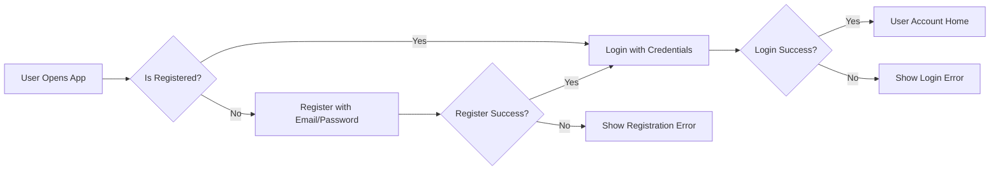
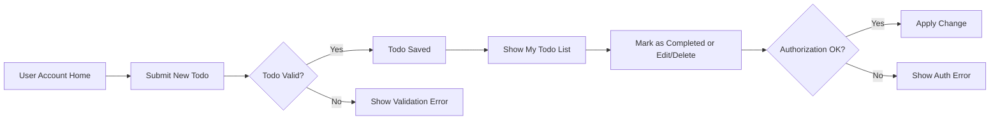
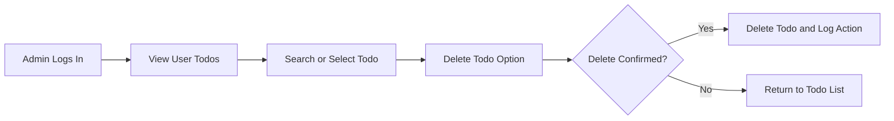

# User Flow for Minimal Todo List Application

## 1. User Registration and Login

### Registration Flow
- WHEN a new user accesses the service, THE system SHALL present a registration option.
- WHEN a user initiates the registration process, THE system SHALL collect a valid, unique email and password meeting business rule requirements (see [Business Rules Document](./08-business-rules.md)).
- WHEN all required registration criteria are satisfied, THE system SHALL create a user account in the "user" role.
- IF the email is already used, THEN THE system SHALL reject registration and display a clear error message.
- WHEN registration is successful, THE system SHALL require account login with email and password.

### Login Flow
- WHEN the user attempts login, THE system SHALL validate the credentials.
- IF credentials are correct, THEN THE system SHALL establish an authenticated session.
- IF credentials are incorrect, THEN THE system SHALL deny access and notify the user.
- THE system SHALL limit login attempts to prevent brute force, as per security policy.

### Logout Flow
- WHEN the user chooses to log out, THE system SHALL terminate the session instantly and remove session tokens.

---

## 2. Adding and Managing Todos

### Add Todo
- WHEN a logged-in user submits a new todo item, THE system SHALL validate task content according to business rules (e.g., content length, prohibited words, due date validity).
- WHEN validation passes, THE system SHALL record the todo item, assigning ownership to the user and setting its state as "active" and "not completed".
- IF validation fails (empty, too long, invalid date, etc.), THEN THE system SHALL reject the creation and return specific error.
- THE system SHALL assign unique IDs to todos per user account.

### View Todo List
- WHEN a user is authenticated, THE system SHALL display all existing todo items owned by the user in a list view, showing status (completed, active, etc.), due date, and content.
- WHERE a user has no todos, THE system SHALL show an empty state response.

---

## 3. Marking Todos as Completed
- WHEN a user marks a todo as "completed", THE system SHALL update its status accordingly and timestamp the completion (see [Business Rules Document](./08-business-rules.md)).
- WHEN a user unmarks a completed todo (returns to active), THE system SHALL clear the completion timestamp.
- IF an operation targets a non-existent or unauthorized todo, THEN THE system SHALL deny the action with a permission error.

---

## 4. Editing and Deleting Todos

### Editing Todos
- WHEN a user edits their own todo, THE system SHALL validate all updates per business rules.
- WHEN validation passes, THE system SHALL save the updated todo, preserving the unique identifier and timestamps.
- IF the edits fail business rules (e.g., empty content, forbidden date changes), THEN THE system SHALL reject and provide actionable error messages.
- IF a user attempts to edit a todo that does not belong to them, THEN THE system SHALL block the request and show an authorization error.

### Deleting Todos
- WHEN a user requests deletion of their own todo, THE system SHALL permanently remove the todo and all associated data from their list.
- IF deletion is successful, THE system SHALL update the list view and confirm the result.
- IF the user attempts to delete a todo they do not own, THEN THE system SHALL deny the action with an error.

---

## 5. Admin-Specific Operations

- WHEN an admin logs in, THE system SHALL grant access to both standard user operations and additional administrative functions.
- THE admin SHALL be able to view all users' todos via a global list/search.
- WHEN an admin determines that a todo violates policy or is required for operational action, THE system SHALL allow the admin to delete any user's todo, removing it from the targeted user's account.
- WHEN deleting as an admin, THE system SHALL record which admin deleted the todo and when, for audit purposes.
- THE admin SHALL NOT be able to edit user passwords or account settings related to authentication (see [User Roles Document](./02-user-roles-and-authentication.md)), unless otherwise described in requirements.

---

## 6. User Flow Diagrams (Mermaid)

### Registration and Login Flow

### Todo Management Flow

### Admin Operation Flow

---

# End of Document