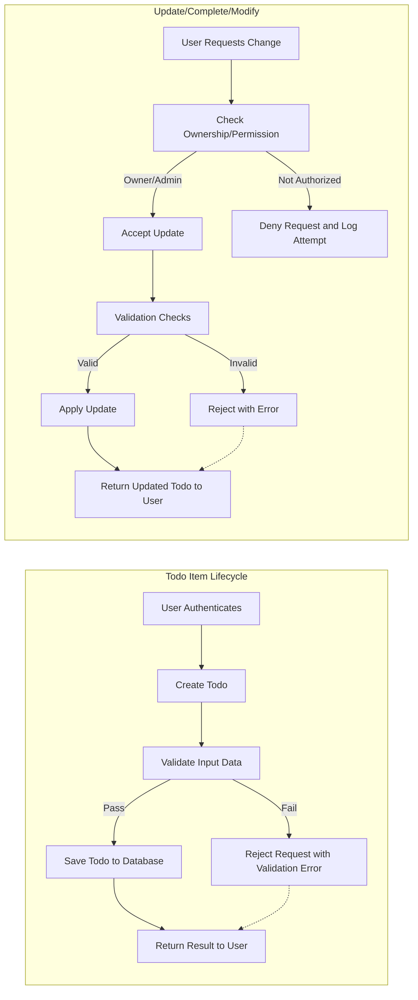

# Business Logic and Validation Rules for Todo List Service

## Business Rule Definitions

### Universal Business Principles
- THE Todo List service SHALL require authentication for all write operations (creating, updating, deleting todos).
- THE system SHALL allow only the owner of a todo item to update or delete it, unless the user has 'admin' privileges.
- WHERE the user has 'admin' role, THE system SHALL permit management (deletion/moderation) of any todo item and user account.
- THE service SHALL ensure that no user except admins can access or modify other users' todo items for privacy.

### User Ownership and Data Privacy
- WHEN a user views their todo list, THE system SHALL show only todos owned by that user,
- IF a user attempts to view, modify, or delete another user's todo item without admin rights, THEN THE system SHALL deny the request and log the attempt.

### Role-Specific Logic
- WHEN an admin performs any destructive action (delete todo, delete user), THE system SHALL record an audit log of the action.

## Input Validation Rules

### Todo Item Fields
- Title (text, required)
  - THE system SHALL require a non-empty title for all todos.
  - THE system SHALL enforce a maximum title length of 100 characters.
  - IF the title field is missing, empty or exceeds 100 characters, THEN THE system SHALL reject the request with a specific error message.
- Description (text, optional)
  - THE system SHALL enforce a maximum description length of 500 characters.
- Status (enum: 'incomplete', 'complete')
  - THE system SHALL allow only 'incomplete' or 'complete' as valid status values for a todo item.
- Due date (datetime, optional)
  - WHERE a due date is provided, THE system SHALL accept only dates in ISO 8601 UTC format.
  - IF a due date is in the past at time of creation/update, THEN THE system SHALL reject the request.

### User Input Patterns
- THE system SHALL reject any input containing control characters or script tags (e.g., to prevent injection/XSS) in any text field.
- THE system SHALL trim leading/trailing whitespace from all user-provided fields before validation and storage.

## Todo Item Business Logic

### Creation
- WHEN a user creates a new todo, THE system SHALL set the owner as the current authenticated user.
- WHEN the todo is created, THE system SHALL mark its status as 'incomplete' by default unless explicitly set to 'complete'.
- WHEN the creation succeeds, THE system SHALL return the full details of the created todo, including time of creation, owner, and all provided fields.

### Editing/Updating
- WHEN a user updates their todo, THE system SHALL allow changes only to their own items, unless they are an admin.
- WHILE a todo is marked as 'complete', THE system SHALL still permit editing of the description and due date.
- IF a non-admin attempts to change the owner or forcibly set a status for another user's item, THEN THE system SHALL reject the update.
- WHEN a due date is updated, THE system SHALL verify the new date is not in the past.

### Deletion
- WHEN a user deletes their own todo, THE system SHALL remove the item permanently from their list.
- WHERE an admin deletes another user's todo, THE system SHALL log the action for audit.
- IF a delete action targets an item that does not exist or does not belong to the user, THEN THE system SHALL reject the request.

### Completing/Marking Incomplete
- WHEN a user marks a todo as complete, THE system SHALL update the status and record the completion time.
- WHEN a user marks a complete todo as incomplete, THE system SHALL clear the completion time.

### Listing and Filtering
- WHEN a user requests their todo list, THE system SHALL return all todos belonging to that user, optionally filtered by status, due date, or keywords in the title/description.
- THE system SHALL support ordering/filtering options as described in [Business Requirements](./03-business-requirements.md).
- IF a filter query is invalid (e.g., malformed date), THEN THE system SHALL reject the request with an error message specifying the field issue.

## Cross-feature Logic or Constraints

### Concurrent Modification
- IF two users (admin and owner) attempt to update the same todo simultaneously, THEN THE system SHALL ensure data integrity by applying optimistic locking or rejecting one update with a "conflict" error.
- THE system SHALL guarantee eventual consistency so that a user's view of their todos always reflects recent changes within 2 seconds.

### Security and Data Retention
- THE service SHALL not retain any deleted todo items; deletion is permanent unless required for admin audit.
- THE system SHALL log all failed attempts to breach access controls (e.g., viewing or editing another user's todo without proper rights).

### Business Pattern Requirements
- THE service SHALL prohibit duplicate todos with identical titles for the same user if the due date is also identical.
- WHEN a user attempts to create such a duplicate, THEN THE system SHALL return an error message explaining the prohibition.

### Compliance and Logging
- THE system SHALL timestamp all creation, update, and completion actions (in UTC), and record the acting user's identifier.

---

## Mermaid Diagram: Generic Todo Workflow

