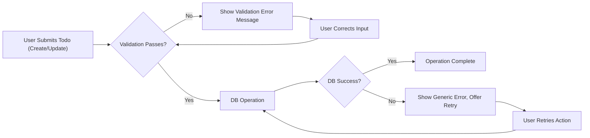

# Error Handling and Recovery Requirements for Minimal Todo List Application

## 1. Common Error Scenarios
This section outlines principal cases where users (registered users and admins) or the system might encounter operational failures and defines expected behaviors for each.

### 1.1. General Business Error Principles
- THE system SHALL provide a clear, actionable error message to the affected user for every failed business process.
- THE system SHALL prevent exposure of technical details or internal states to end users.
- THE system SHALL log all errors internally for later admin review while protecting user privacy.
- WHEN an error occurs, THE system SHALL preserve user-entered data unless its integrity is compromised.

## 2. Validation Failures
Validation failures occur when user input does not meet business-defined constraints for todos (e.g., missing text, excessive length, invalid due date).

### 2.1. Empty or Invalid Todo Content
- WHEN a user attempts to create or update a todo with empty content, THE system SHALL reject the request and return an error message indicating that todo content cannot be empty.
- WHEN a user submits todo content exceeding the allowed length, THE system SHALL reject the request and display an error message specifying the maximum character limit.
- WHEN a user includes disallowed characters or input types, THE system SHALL deny the action, indicate the invalid content, and prompt for correction.

### 2.2. Invalid Due Date
- WHEN a user tries to set a due date in an incorrect format or with a date in the past, THE system SHALL reject the request and explain that due dates must be in the future using the required format.

### 2.3. Invalid Update or Deletion Request
- WHEN a user attempts to update or delete a todo without specifying a valid todo identifier, THE system SHALL deny the action and prompt for clarification or correction.

## 3. Authorization and Access Denied
This section describes how the system manages access control failures.

### 3.1. Unauthorized Access (Not Logged In)
- WHEN a non-authenticated user tries to create, modify, or delete any todo, THE system SHALL deny access and prompt the user to log in.

### 3.2. Forbidden Action (Insufficient Permission)
- WHEN a user attempts to view, modify, or delete a todo that they do not own, THE system SHALL deny the request and inform the user that only the owner (or admin, if applicable) may access this resource.
- WHEN an admin deletes a user's todo, THE system SHALL record the action for audit purposes and provide a business-appropriate notification indicating administrative intervention.

### 3.3. Session Expiration
- WHEN a user’s authentication session expires, THE system SHALL invalidate access, inform the user, and prompt re-authentication before allowing further actions.

## 4. Data Integrity Issues
Failures arising from system or storage problems, accidental duplicates, or corrupted data.

### 4.1. Todo Not Found
- WHEN a user or admin requests access to a non-existent todo, THE system SHALL respond with an error stating that the requested todo does not exist or has already been deleted.

### 4.2. Duplicate Todos Prevention
- WHEN a user attempts to create a todo that is an exact duplicate of an existing todo in their list, THE system SHALL warn the user and prevent duplicate creation.

### 4.3. Unexpected Data State
- IF underlying data is found to be corrupted or inconsistent, THEN THE system SHALL block the current action, notify the user of a temporary issue, and recommend retrying later.
- WHEN system-side errors occur that prevent successful transaction completion, THE system SHALL not apply any partial changes and must guarantee atomicity for all business actions.

## 5. User Recovery Actions
This section covers the business process by which users are guided to recover from errors as painlessly as possible.

### 5.1. User Correction Workflow
- WHEN a validation error is encountered, THE system SHALL present the user with actionable, specific guidance to correct the input.
- WHEN a todo operation fails, THE system SHALL retain any valid information the user previously entered (where safe to do so) to avoid user rework.

### 5.2. Retrying Failed Actions
- WHEN an operation fails due to temporary system or network errors, THE system SHALL offer the user the ability to retry the same action after a short interval.
- WHERE a repeat action may produce a duplicate, THE system SHALL prevent duplicate entries and prompt for confirmation as appropriate.

### 5.3. Escalation to Admin
- WHEN a persistent unrecoverable error prevents the user from managing their own todos, THE system SHALL direct the user to a support or admin contact channel (email or help resource, as appropriate to the business model).
- THE admin role SHALL have access logs and tools to investigate error cases, limited to the minimum data required for resolution.

### 5.4. Example Error and Recovery Flow

## 6. Success Criteria for Error Handling
- THE system SHALL provide a user message for every error, stating the exact business reason for failure.
- THE system SHALL never expose stack traces or internal error details in user-facing messages.
- THE system SHALL ensure every error state leads to a logical, recoverable end state or clear escalation path.
- THE system SHALL log all errors for future analysis by administrators.

---

# Reference to Related Documents
- For detailed permissions and user roles, see [User Roles and Authentication Requirements](./02-user-roles-and-authentication.md).
- Business and validation rules are specified in [Business Rules for Todos](./08-business-rules.md).
- Functional requirements are described in [Functional Requirements](./03-functional-requirements.md).
- Data protection practices can be reviewed in [Privacy and Data Protection](./09-privacy-and-data-protection.md).