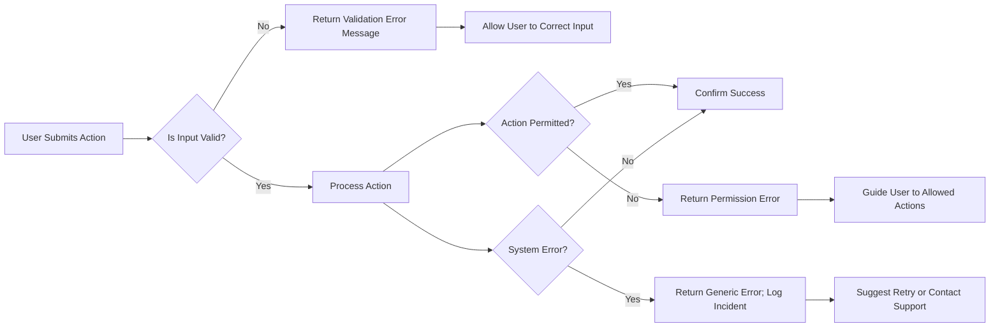

# Error Handling Specification for Todo List Application

## 1. Common Error Scenarios

The todo list application involves the following broad error scenarios from the business logic perspective:
- Data input/validation errors (e.g., missing required fields, invalid formats)
- Authentication failures (e.g., invalid login, expired session)
- Permission errors (user attempts to access or modify another user's data)
- Resource not found (request for non-existent todo item)
- Action constraints (attempting prohibited actions, such as duplicate adds or deleting completed items in bulk)
- Unexpected/internal system errors (system unavailable, unknown issues)

### EARS Event-Driven Statements for General Error Handling
- WHEN an error occurs, THE system SHALL provide a clear message in the user locale language indicating the nature of the error and next steps.
- WHEN an action fails, THE system SHALL log the failure, including context and user info, for auditing and troubleshooting.
- WHEN a recoverable error is encountered, THE system SHALL allow the user to correct their input or retry the action where possible.

## 2. Validation Errors

Validation errors arise when a user submits incorrect, missing, or malformed data (e.g., creating or updating a todo item). Business validation logic includes:

### Required Fields
- WHEN a user creates or updates a todo, THE system SHALL require the "title" field (non-empty, max 255 characters).
- WHEN a user creates or updates a todo, THE system SHALL accept an optional "description" field (max 1000 characters).
- WHEN a user creates or updates a todo with a due date, THE system SHALL require the due date to be a valid ISO 8601 date string not in the past.

### Completion & Status Changes
- IF a user attempts to mark a todo as completed that is already marked as completed, THEN THE system SHALL return an error indicating the item is already completed.
- IF a required field is missing, THEN THE system SHALL specify which field is missing in the error message.
- IF a field exceeds the allowed length, THEN THE system SHALL indicate the field and allowed maximum in the error.
- IF a due date is not in valid ISO 8601 format, THEN THE system SHALL instruct the user to use the correct format (e.g., YYYY-MM-DD).
- IF a due date is set in the past, THEN THE system SHALL reject the submission and inform the user accordingly.

### Bulk Operations
- WHEN performing bulk operations, THE system SHALL validate that all listed todo items belong to the requesting user before processing.
- IF one or more items in a bulk operation are invalid or do not belong to the user, THEN THE system SHALL return an error listing the offending items and provide options to retry without those items.

**Sample Error Message Table:**

| Condition                          | Error Message                                                      |
|-------------------------------------|--------------------------------------------------------------------|
| Missing title                       | "The field 'title' is required."                                  |
| Title too long                      | "The field 'title' cannot exceed 255 characters."                 |
| Invalid due date                    | "The field 'due date' must be in YYYY-MM-DD format."              |
| Due date in the past                | "Due date must not be in the past."                               |
| Unauthorized bulk operation         | "One or more selected items are not yours and cannot be changed." |
| Already completed item              | "This todo is already marked as completed."                       |

## 3. Authentication and Permission Errors

The system supports only registered authenticated users (role: user). Permission logic prevents users from accessing, modifying, or deleting todos not owned by them and enforces session validity.

### Authentication
- WHEN a user provides invalid login credentials, THE system SHALL reject the attempt and return a message: "Invalid email or password."
- IF a user’s session is expired, THEN THE system SHALL reject the request and prompt the user to re-authenticate ("Your session has expired. Please log in again.").

### Authorization
- IF a user attempts to access a todo item owned by another user, THEN THE system SHALL reject the access and display: "You do not have permission to view or modify this item."
- WHEN an unauthenticated request is made to any protected endpoint, THE system SHALL reject the request and indicate that authentication is required.

### Session and Token
- IF a JWT token is expired or malformed, THEN THE system SHALL reject the request and return an authentication error ("Session invalid or expired. Please log in.").
- WHEN a user is forcibly logged out (e.g., due to password change), THE system SHALL revoke all tokens and require re-login on all devices.

## 4. User Guidance and Recovery

The system focuses on transparency and empowering self-recovery:

### User Messaging Principles
- Error messages SHALL be concise, actionable, and free of technical jargon.
- WHERE common mistakes are made, THE system SHALL suggest corrective actions instead of just rejecting input.
- WHEN a validation error occurs, THE system SHALL highlight (or return via API) which fields are incorrect or require attention.

### Step-By-Step Recovery Scenarios

**Input Errors:**
- WHEN user input is invalid, THE system SHALL allow the user to edit the erroneous data and resubmit.

**Session Loss:**
- WHEN a session expires, THE system SHALL redirect or notify the user to log in again and attempt the previous action after re-authentication.

**Permission Denials:**
- WHEN a permission error occurs, THE system SHALL communicate the lack of access and suggest returning to the main todo list or contacting support if needed.

**Bulk Operation Partial Failures:**
- WHERE some items in a bulk operation succeed and others fail, THE system SHALL report which items failed and why, enabling the user to retry only the failed items.

**System/Internal Errors:**
- WHEN an unexpected system failure occurs, THE system SHALL provide a generic error message ("An unexpected error occurred. Please try again later.") and automatically log the incident.
- IF a repeated system failure is detected, THEN THE system SHALL suggest contacting support and provide a reference code.

### Example Mermaid Diagram: Error Handling and Recovery Flow

## Summary Table: Error Categories and Recovery Guidance

| Error Type                   | User Message                                        | Recovery                                                   |
|------------------------------|----------------------------------------------------|------------------------------------------------------------|
| Validation Error             | Specific field error (see table above)              | Edit input, resubmit                                       |
| Authentication Failure       | "Invalid email or password."                       | Re-enter credentials, reset password if forgotten          |
| Session Expired              | "Session expired. Please log in again."            | Log in again; action retriable                             |
| Permission Denied            | "You do not have permission for this action."      | Return to todo list; contact support for help              |
| Not Found                    | "Todo item not found."                             | Verify ID, refresh list, or create new item                |
| Bulk Operation Partial Fail  | "Some items could not be updated."                 | Review errors; retry with valid set                        |
| System/Internal Error        | "An unexpected error occurred."                    | Retry later; contact support with reference code if needed |

## EARS Summary for All Error Scenarios
- WHEN user input validation fails, THE system SHALL inform the user which field(s) are incorrect and allow correction.
- WHEN authentication fails, THE system SHALL return an explicit error message and offer self-service recovery steps (e.g., password reset).
- WHEN a user is unauthorized for a resource, THE system SHALL return a permission error and suggest allowed actions.
- WHEN an internal application error is detected, THE system SHALL provide a generic error message and log the incident for administrative review.
- WHEN a bulk operation partially fails, THE system SHALL report which items failed and why, and enable retry for those items.

---

For full field validation and business workflow requirements, see the [Functional Requirements Document](./06-functional-requirements.md). For role descriptions and permission details, reference the [Authentication and Roles Specification](./05-authentication-and-roles.md).