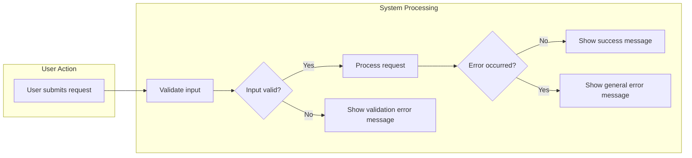

# Error Handling and Exceptions for Todo List Application

## Common Error Scenarios

Todo List application users may encounter the following common error scenarios. Each scenario triggers specific business logic responses as described.

### Data Validation Errors
WHEN a user provides invalid input while creating or editing a todo item (e.g., missing required fields, exceeding character limits, invalid characters), THE system SHALL reject the operation and present a user-friendly error message indicating which field is invalid and why.

### Unauthorized or Unauthenticated Actions
WHEN a user attempts to access or modify data without sufficient authentication or authorization (e.g., unauthenticated access, attempts to modify others' todos), THE system SHALL deny access and present a clear error message stating that authentication or authorization is required.

### Resource Not Found
WHEN a user requests a todo item or resource that does not exist (e.g., invalid todo ID, deleted todo), THE system SHALL inform the user that the requested item was not found and offer guidance to return to a valid list or retry.

### System and Server Errors
WHEN an unexpected internal server error or unhandled exception occurs, THE system SHALL display a message indicating that an error occurred and encourage the user to retry or contact support if the problem persists.

### Conflict Errors
WHEN a user attempts an action that leads to a conflict (e.g., attempting to update a todo that has been concurrently deleted or updated elsewhere), THE system SHALL reject the request and display a clear message explaining the conflict, with potential corrective recommendations (e.g., "Please refresh and try again").

### Rate Limit or Excessive Requests
WHERE excessive requests are detected from a user or client, THE system SHALL temporarily block further requests and notify the user with a message describing the reason and expected wait period before retrying.

## User-friendly Error Messages

- THE system SHALL present all error messages in plain, concise language that clearly explains the issue and next steps.
- WHEN an error message is displayed, THE system SHALL avoid exposing technical details or stack traces, providing only remedial instructions or contact options as appropriate.
- Error messages SHALL be actionable, guiding the user on how to fix the issue or where to seek additional help.

#### Example Error Message Table
| Error Scenario                 | Example Message                                      |
|-------------------------------|-----------------------------------------------------|
| Validation failed (empty todo) | "Please enter a description for your todo item."   |
| Unauthorized action            | "You must be logged in to perform this action."    |
| Not found                      | "The requested todo could not be found."           |
| Server error                   | "An error occurred. Please try again later."       |
| Conflict                       | "This todo was changed elsewhere. Refresh to retry."|
| Rate limited                   | "Too many requests. Please wait before trying again."|

## Validation Failure Handling

- WHEN input fails validation (empty fields, max-length exceeded, invalid values), THE system SHALL return a specific error code and user-friendly message describing the failed validation field and corrective action.
- THE system SHALL not create or update todos with invalid data under any circumstances.
- IF multiple fields are invalid, THEN THE system SHALL report all errors together, not just the first encountered.
- THE system SHALL enforce consistency and clarity in all validation failure messages.

## Authentication/Authorization Failures

- WHEN a non-authenticated user attempts an operation that requires login, THE system SHALL deny the request and instruct the user to log in.
- WHEN an authenticated user attempts an action outside their permissions (e.g., user modifying another user's todo), THE system SHALL deny the action and explain that only owners or authorized roles (like admin) can perform the requested operation.
- THE system SHALL never reveal privileged information to unauthorized users.

## Recovery and Retry Guidance

- WHEN a correctable error occurs (e.g., validation, not found, rate limit), THE system SHALL provide actionable steps for recovery (such as retry after correction or waiting a specified interval).
- WHEN a fatal error occurs (e.g., internal server error), THE system SHALL prompt the user to retry and—with persistence—provide a way to escalate (e.g., link to support or error reporting).
- THE system SHALL provide consistent recovery instructions for users after errors, tailored to each scenario.

### Mermaid Sequence Diagram: General Error Handling Flow

## Additional Requirements

- THE system SHALL log all errors for backend monitoring and improvement but never expose sensitive information in user messages.
- THE system SHALL support error localization for multilingual support if the application is internationalized.
- THE system SHALL provide detailed error code mappings for use by frontend and support staff.

## Performance and UX Considerations
- WHEN handling errors, THE system SHALL maintain responsiveness, ensuring all error and recovery messages are rendered within 2 seconds of user action, under normal operating conditions.

## Success Criteria
- All error scenarios are clearly handled with actionable, specific user messages.
- No technical details or sensitive information are leaked to users via error messages.
- Users are always informed of the recovery path or next actionable step after any error occurs.
- Backend receives adequate error logging for future improvements, independent of user-facing messaging.
