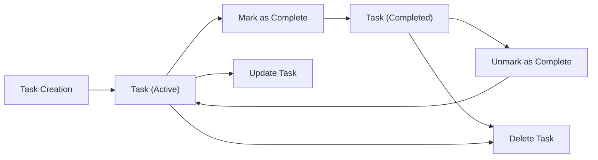

# Business Rules & Validation Requirements for Minimal Todo List Application

## Introduction

This document establishes the set of business rules, field validation logic, and operational constraints that define how the minimal Todo list application operates from a business perspective. These requirements are designed to support lean, reliable core functionality, eliminate ambiguity, and enforce minimalism in feature scope and system complexity. All requirements follow the EARS framework for clarity and testability and are strictly limited to only those necessary for basic, single-user Todo functionality, with simple administrator support for user and task management.

For a comprehensive list of required features, refer to the [Functional Requirements Document](./08-functional-requirements.md). For error and exception management, see the [Error & Exception Handling Document](./10-error-exception-handling.md).

## Todo Task Rules

### Core Task Lifecycle
- THE system SHALL allow registered users to create, view, update, mark as complete/incomplete, and delete their own Todo tasks.
- WHERE the user is an administrator, THE system SHALL allow full visibility and management (creation, viewing, updating, completion, deletion) of all users' tasks.
- THE system SHALL never allow a user to view or modify another user's tasks unless that user is an administrator.

### Task Ownership and Permissions
- WHEN a registered user creates a task, THE system SHALL assign task ownership to that user.
- IF a user attempts to act on a task they do not own and is not an administrator, THEN THE system SHALL deny the action and provide an appropriate error response.
- WHEN an administrator acts on any task, THE system SHALL allow all management actions, overriding task ownership restriction.

### Task State and Status
- THE system SHALL maintain a binary status for each task: active or completed.
- WHEN a user marks a task as complete, THE system SHALL record the completion timestamp.
- WHEN a user un-marks a task as complete, THE system SHALL clear or null the completion timestamp, returning it to active status.

### Task Deletion
- WHEN a user deletes a task, THE system SHALL permanently remove the task and all its associated data.
- WHERE the user is an administrator, THE system SHALL allow deletion of any task, including those belonging to other users.

## Validation Rules

### Field-Level Validation for Todos

#### Title
- THE system SHALL require every Todo task to have a non-empty title upon creation.
- THE system SHALL trim leading and trailing whitespace from the title before validation and storage.
- THE system SHALL restrict titles to a maximum of 100 characters after trimming whitespace.
- IF the title is empty or exceeds 100 characters (after trimming), THEN THE system SHALL reject the request and provide a validation error.
- THE title field SHALL NOT allow line breaks or special formatting (e.g., Markdown).

#### (Optional) Description
- THE system SHALL NOT require a description field (as per minimalism principle). If implemented, description SHALL be limited to 500 characters and trimmed of whitespace.

#### Status
- THE system SHALL store task status as a boolean or enumerated value: "active" or "completed."
- THE system SHALL prohibit invalid status transitions (e.g., marking an already completed task as complete does nothing).

#### Timestamps
- THE system SHALL automatically manage all creation, update, and completion timestamps. Users SHALL NOT be able to set or edit timestamps manually.
- All timestamps SHALL be stored in ISO 8601 format, with time zone set to UTC.

#### Task Identifier
- THE system SHALL assign a unique identifier to each task at the time of creation, ensuring non-duplication per user.
- THE system SHALL NOT allow manual setting or editing of task identifiers by users.

### Ownership & Permission Validation
- THE system SHALL verify that any task action (view, edit, delete, mark complete/incomplete) is initiated by the owner or an administrator.
- IF an ownership or permission violation is attempted, THEN THE system SHALL reject the action with a clear, actionable error message.

## Operational Constraints

### Per-User Task Limits
- THE system SHALL allow each user to have up to 100 active Todo tasks at any given time.
- IF an attempt is made to create a new task when the user already has 100 active tasks, THEN THE system SHALL reject the request with a limit-exceeded message.
- Completed tasks DO NOT count against the 100 active task limit.

### System-Wide Constraints
- THE system SHALL not provide recurring tasks, priorities, deadlines, reminders, labels/tags, or attachments (minimalism principle).
- THE system SHALL not expose any additional metadata fields outside of those specified in this document.
- THE system SHALL operate with stateless, single-user task management per account, with no dependencies or shared task lists unless accessed by an administrator.

### Admin Constraints
- THE system SHALL allow administrators to view, edit, and delete any user's tasks.
- Administrators SHALL NOT be subject to the per-user task limit for management actions.
- Administrators SHALL NOT create tasks "as" other users (they may create tasks for themselves or delete/modify existing tasks for any user).

### Concurrency
- WHILE a user is editing a task, THE system SHALL serialize update actions to avoid data loss or race conditions (i.e., avoid two simultaneous modifications on the same task).

## Edge Cases & Exception Handling

- IF a user or admin attempts to edit or delete a task that does not exist, THEN THE system SHALL return a not-found error message.
- IF a user attempts to delete a completed task, THEN THE system SHALL execute the deletion (no additional confirmation required beyond standard operation).
- IF a deletion action removes a user's last remaining task, THEN THE system SHALL permit an empty state (no minimum task requirement).
- IF invalid input data is submitted (e.g., missing required title, title too long), THEN THE system SHALL reject the request and return all relevant validation error messages.
- THE system SHALL ensure that all actions are atomic: a failure in validation or storage SHALL NOT result in partial saves or incomplete state changes.

## Mermaid Diagram: High-Level Task Lifecycle

## Compliance and Alignment with Minimalism Principle

- THE system SHALL exclude all non-essential features outside the core list/task flow described above.
- WHERE an enhancement or extra validation could create confusion or friction in the minimal workflow, THE system SHALL favor simplicity and clarity.
- THE system SHALL prioritize clear error messaging and predictable outcomes, avoiding hidden states or behaviors.

All business rules, validations, and constraints specified in this document MUST be adhered to in all backend implementation logic. No additional business features, fields, or validation rules are permitted unless specifically listed in the [Functional Requirements Document](./08-functional-requirements.md) or dictated by legal/compliance requirements.