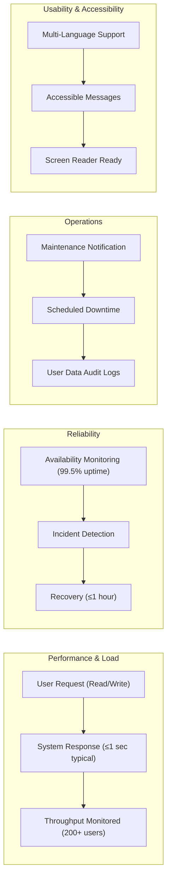

# Non-Functional Requirements for Todo List Application

## 1. Performance Requirements (Response Time, Throughput)

- WHEN a user requests the list of their own todos, THE todoList system SHALL return the list within 1 second for up to 500 items.
- WHEN a user creates, updates, or deletes a todo item, THE todoList system SHALL complete the operation and return confirmation within 1 second.
- THE todoList system SHALL support a minimum of 200 concurrent authenticated users with no degradation of response time beyond 1 second per write operation and 1.5 seconds per read operation.
- WHERE the system is under excessive load (defined as more than 500 requests per second), THE todoList system SHALL maintain core create, update, delete, and view operations, even if non-essential features must be degraded or shed.
- WHERE the todoList system responds to a valid API request, THE system SHALL always include an explicit status code and clear messaging for successful or failed operations.

## 2. Reliability and Availability

- THE todoList service SHALL be available for end users at least 99.5% of every calendar month, excluding scheduled maintenance notifications issued at least 24 hours in advance.
- WHEN a service failure or unplanned downtime occurs, THE system SHALL recover and resume full availability within 1 hour.
- THE system SHALL ensure that no more than one minute of user data is lost in any incident (data durability).
- IF a user operation cannot be completed due to backend errors, THEN THE todoList system SHALL provide the user with a human-readable error and guidance to retry the operation.
- WHEN system maintenance is required, THE system SHALL notify all active users at least 5 minutes before disconnecting any active sessions.

## 3. Operational Constraints

- THE todoList service SHALL only accept legal, UTF-8 encoded data in all text fields.
- THE system SHALL persist all todo data in durable storage with successful confirmation only after data is safely committed.
- WHERE system operations require scheduled maintenance, THE todoList team SHALL announce windows at least 24 hours in advance whenever possible.
- THE system SHALL log all administrative actions (e.g., todo deletion by admin, user account management) for at least 30 days for audit.
- THE todoList system SHALL not allow any administrative action that would delete user data without explicit, auditable intent.

## 4. Usability (Business-level Only)

- THE todoList system SHALL be usable by individuals with no prior training or onboarding documentation.
- WHERE a user attempts to perform an unsupported action, THE system SHALL display a clear message describing the limitation and, where appropriate, guide them towards available actions.
- THE system SHALL ensure that all actions, confirmations, and errors are written in language appropriate for general audiences, at an eighth-grade reading level or below.
- THE system SHALL present all content consistently in the user’s preferred language (when localization is available), defaulting to English otherwise.

## 5. Internationalization, Accessibility

- THE todoList system SHALL support content (both input and output) in any language that can be encoded with UTF-8, with a minimum guarantee for full English support at launch.
- WHERE a user’s preferred locale is detected or selected, THE system SHALL display all system-generated messages, status updates, and error notifications in that locale if available.
- THE system SHALL accommodate right-to-left (RTL) and left-to-right (LTR) languages for all business content.
- THE todoList system SHALL comply with all mandatory accessibility requirements for the user’s jurisdiction (e.g., U.S. Section 508, WCAG 2.0 Level AA where required by business policy).
- THE system SHALL ensure that all confirmation, status, and error messages are provided in text (not images) for screen reader compatibility.

---

## Mermaid Diagram: System Quality Attributes Overview

---

## Success Criteria

- Service responses meet the specified latency and throughput targets under defined load (see section 1).
- Uptime, data durability, and recovery targets are met monthly (see section 2).
- Operations, logs, and business process auditability satisfy business compliance for a simple productivity tool (section 3).
- All user-facing content is language-appropriate, and primary operations are accessible by default for general audiences, including those with disabilities (sections 4 & 5).

---

This document provides business non-functional requirements only. All technical implementation decisions—including architecture, software stacks, and database solutions—are at the sole discretion of the development team. The document describes WHAT the system must achieve from a business perspective, not HOW to build it.