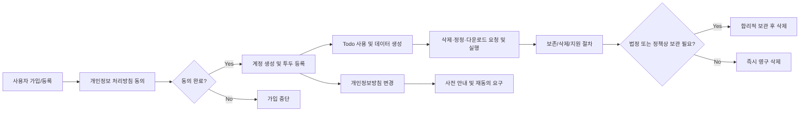

# Todo List 개인정보 보호 및 데이터 처리 요구사항

## 1. 데이터 처리 정책

### 수집 데이터 유형
- THE 서비스 SHALL 최소한의 데이터만 수집한다: 계정 식별자(이메일), 인증 정보, 소유한 todo 데이터(제목, 내용, 완료여부, 선택적 기한), 기본 로그(타임스탬프, 변경 기록 등)로 제한한다.
- THE 서비스 SHALL 사업상의 목적 외 데이터는 수집 및 저장하지 않는다.
- THE 서비스 SHALL 수집 데이터 사용 목적(업무 운영, 유지, 개선) 외 타 용도(3자 제공, 마케팅 등)로 활용하지 않는다.
- WHEN 데이터가 서비스 개선·분석 목적으로 처리될 때, THE 서비스 SHALL 반드시 익명화하거나 비식별 정보만 사용한다.
- WHERE 법률이 요구하는 경우 외에는, THE 서비스 SHALL 어떠한 개인정보도 외부에 제공하지 않는다.
- IF 사법기관이나 법령상 적법한 요구가 있을 때, THEN THE 서비스 SHALL 꼭 필요한 최소 범위만 제공하고, 허용되는 경우 사용자에게 알린다.

## 2. 사용자 동의 흐름

### 가입 시 명시적 동의
- WHEN 신규 사용자가 계정 생성 시도 시, THE 서비스 SHALL 수집 정보, 이용 목적, 권한 안내 등 명시된 개인정보 처리 방침을 제공한다.
- WHEN 사용자 계정을 생성할 때, THE 서비스 SHALL 개인정보 처리방침에 대한 명확한 동의 절차를 필수적으로 거친다.

### 지속적 동의 및 철회
- WHERE 사용자가 서비스를 계속 이용하는 경우, THE 서비스 SHALL 최초 동의 내용에 한해 지속적 동의로 간주한다.
- WHERE 사용자가 동의 철회를 원하면, THE 서비스 SHALL 철회 요청 통로를 제공하고 법적/운영상의 예외를 제외하고 즉시 모든 관련 데이터 처리를 중단한다.
- IF 사용자가 동의를 철회한 경우, THEN THE 서비스 SHALL 필수 보관 사유(법적·회계 등)를 제외한 개인정보 및 todo 데이터를 즉시 삭제한다.

### 약관 및 정책 변경
- WHEN 개인정보 관련 정책이 실질적으로 변경될 때, THE 서비스 SHALL 사전 안내 및 추가 동의(필요시)를 요구한다.

## 3. 접근 로그 및 데이터 보관/파기

### 접근 및 변경 로그
- THE 서비스 SHALL 사용자 데이터 접근·삭제 등 주요 행위 발생 시, 사용자·시간·행위 내용을 보안적으로 기록한다.
- WHEN 관리자가 타인 데이터를 접근/삭제/수정 시, THE 서비스 SHALL 사유, 관리자 신원, 시간 등의 정보와 함께 로깅한다.
- WHERE 법적으로 허용되는 한, 사용자도 자신의 접근 내역 요약본 제공을 요청할 수 있다.

### 데이터 보관 및 파기 정책
- THE 서비스 SHALL 사용자 데이터는 사업 제공·유지에 필요한 최소 기간만 보관하고, 그 후에는 반드시 완전 삭제한다.
- WHEN 사용자가 계정/데이터(목록 등) 삭제를 요청하면, THE 서비스 SHALL 관련 데이터를 지체 없이 영구 삭제하며, 법령상 예외기간(최대 30일) 내 처리한다.
- WHERE 법적 보관 의무가 있을 경우에만 일정 기간 보관하고, 보존 기간 종료 즉시 파기한다.
- AFTER 법적 보관기간이 만료되면, THE 시스템 SHALL 사용자의 인적 식별이 가능한 모든 데이터를 영구 파기한다.

## 4. 삭제 및 수정 권리

### 사용자의 데이터 삭제·수정·이동 권리
- WHEN 사용자가 데이터(계정, todo 등) 삭제를 요청하면, THE 서비스 SHALL 지체 없이 처리를 진행하고 법령상 예외를 제외하면 즉시 삭제한다.
- WHEN 사용자가 내 todo 또는 프로필 정보 수정 요청 시, THE 서비스 SHALL 사업 규칙이 허용하는 한(예: 관리자 조사 중 제외) 언제든 변경할 수 있게 한다.
- WHERE 기술적으로 가능한 경우, THE 서비스 SHALL 사용자가 자신의 todo/개인정보 전체를 표준 디지털 파일로 즉시 다운로드 받을 권리를 제공한다.

### 관리자의 권한 및 알림
- WHEN 관리자가 사용자의 todo에 대해 불법, 악성, 정책 위반 내용을 발견하면, THE 서비스 SHALL 해당 데이터를 삭제할 수 있으나, 사유·시간·관리자 정보를 반드시 기록한다.
- IF 법에 특별한 제한이 없는 한, THE 서비스 SHALL 데이터 주체(사용자)에게 알림 처리한다.

## 5. EARS 형식 예시 요구사항 및 오류·예외 플로우

- WHEN 데이터 삭제 요청이 접수될 경우, THE 서비스 SHALL 보관 기한을 체크 후, 만료 시 즉시 영구 삭제한다.
- IF 법적 보존 기간 미경과 투두/계정 삭제 요청이 오면, THE 서비스 SHALL 임시 비활성 처리 후 만료시점에 자동완전삭제 플로우를 적용한다.
- WHEN 접근 로그 내역 전송 요청이 오면, THE 서비스 SHALL 본인 확인을 거쳐 요약본을 발송한다.
- IF 관리자가 데이터를 삭제하면, THEN THE 서비스 SHALL 즉시 행위 내역을 관리자/사용자별 로그로 남긴다.
- WHEN 개인정보 변경 또는 동의 철회 실패(예: 내부 오류) 시, THE 서비스 SHALL 사용자에게 원인 및 추가 조치 방법을 안내한다.
- IF 데이터 삭제(영구, 임시) 과정에서 DB 오류가 발생하면, THE 서비스 SHALL 사용자에게 실시간 안내 후, 복원 가능여부 및 재시도 옵션을 제공한다.

## 6. 정보 흐름 및 권리 처리 다이어그램 (머메이드)

## 7. 사업 규칙, 오탈자 방지, 연계 규정
- THE 서비스 SHALL 개인정보 보호, 데이터 보관, 삭제, 접근권 덕을 명확히 관리하고, 모든 내부 로그·사용자 알림·동의절차·오류처리 등에 누락이 없도록 한다.
- WHERE 추가 사업 규칙(관리자 예외/특정법 적용 등)이 필요한 경우, 각 문서(인증, 업무규칙, 오류처리 등) 내 [관련 문서](./02-user-roles-and-authentication.md), [업무 규칙](./08-business-rules.md), [오류 처리](./07-error-handling-and-recovery.md)를 적절히 참조한다.
- 이 요구사항은 기술 구현 지시가 아닌, 비즈니스 요구와 운영 측면에 한정한다.