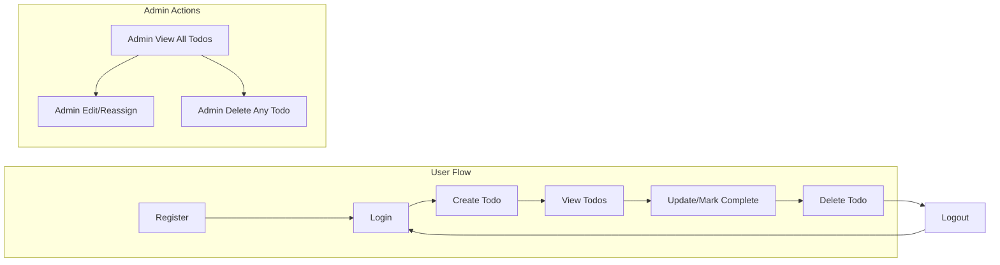

# Functional Requirements Specification for Minimal Todo List Application

## Core Functional Requirements

### 1. User Registration and Authentication
- WHEN a user provides valid registration details (email, password), THE system SHALL create a new user account.
- WHEN a user provides valid login credentials, THE system SHALL authenticate the user and create a user session.
- IF login credentials are invalid, THEN THE system SHALL deny access and provide an error message.
- WHEN a logged-in user requests to log out, THE system SHALL end the user session.
- THE system SHALL ensure that only authenticated users can access any Todo functions (view, create, update, delete their own Todos).

### 2. Todo Task Creation
- WHEN an authenticated user submits a new Todo with valid content, THE system SHALL create a new Todo item associated with that user.
- IF a Todo description is empty or only whitespace, THEN THE system SHALL reject the creation request and provide an error message.
- THE system SHALL limit the maximum Todo description length to 255 characters. IF description exceeds 255 characters, THEN THE system SHALL reject the creation request with an error message.

### 3. Viewing Todos
- WHEN an authenticated user requests their Todo list, THE system SHALL provide all their own Todo items, sorted in reverse-chronological order of creation (newest first).
- WHERE the authenticated user is an administrator, THE system SHALL provide the ability to view all users' Todo lists.
- THE system SHALL not display any user's Todo to any other non-admin user.

### 4. Editing/Updating Todos
- WHEN an authenticated user requests to edit a Todo they own, THE system SHALL allow updates to the description and completion status.
- IF a user attempts to edit a Todo they do not own and is not an administrator, THEN THE system SHALL reject the request with an error message.
- IF the user provides an empty or whitespace-only description during update, THEN THE system SHALL reject the update and provide an error message.

### 5. Marking Todos as Complete or Incomplete
- WHEN the user changes a Todo's completion status, THE system SHALL update the status accordingly for that Todo.
- THE system SHALL track a boolean completion status (complete/incomplete) for each Todo item.

### 6. Deleting Todos
- WHEN a user requests to delete their own Todo, THE system SHALL remove that Todo from their list.
- IF a user attempts to delete a Todo they do not own and is not an administrator, THEN THE system SHALL reject the request with an error message.

### 7. Administrative Functions
- WHERE the acting user has the admin role, THE system SHALL permit administration of any user’s Todos, including view, edit, and delete actions.
- WHEN an admin deletes or edits a Todo, THE system SHALL record that the action was performed by an administrator.

### 8. Data Integrity
- THE system SHALL enforce that each Todo is always associated with exactly one user (owner).
- THE system SHALL ensure that deleting a user will permanently remove all their Todos.

### 9. Out of Scope (to guarantee minimalism)
- THE system SHALL NOT provide label, category, priority, or deadline fields for Todos.
- THE system SHALL NOT support recurring Todos, reminders, file attachments, or sharing between users.
- THE system SHALL NOT allow partial updates except for description and status.

## Acceptance Criteria

1. WHEN a user registers and logs in, they SHALL be able to create, view, edit, complete/incomplete, and delete only their own Todos.
2. IF a user attempts to access, edit, or delete any Todo they do not own (and are not admin), THEN THE system SHALL prevent the action with an error.
3. WHERE the user is an admin, THEY SHALL be able to view, edit, and delete any user's Todos system-wide.
4. WHEN any action fails due to permission, ownership, or input validation, THE system SHALL provide a clear, actionable error message.
5. WHEN displaying a user's Todos, THE system SHALL always show the most recently created or updated Todos at the top.
6. WHEN a user deletes their account, all their Todos SHALL be deleted permanently.
7. THE system SHALL always return own Todos only for standard users and all Todos for admins in list endpoints.
8. THE system SHALL support at least 1,000 active users and 10,000 total Todos with no decrease in expected response time.

## Non-Functional Requirements

- THE system SHALL provide a response to all Todo CRUD actions within 2 seconds under normal load (up to 10 requests per second).
- IF the system cannot complete a requested operation due to server error, THEN THE system SHALL notify the user with a generic error message and log the technical details for admin review.
- THE system SHALL store all user and Todo data securely, accessible only to authenticated users and authorized admins.
- THE system SHALL log all administrative actions (edit, delete) performed by administrators for audit purposes.
- THE system SHALL be protected against unauthorized access to Todo and user data by enforcing role and ownership checks at all endpoints.

## Visual Representation: Minimal Todo State Diagram

# End of document