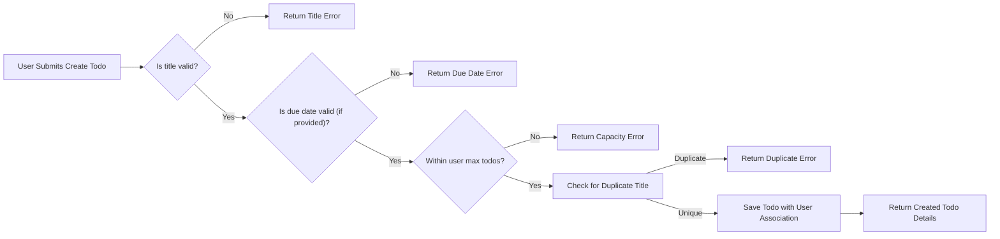
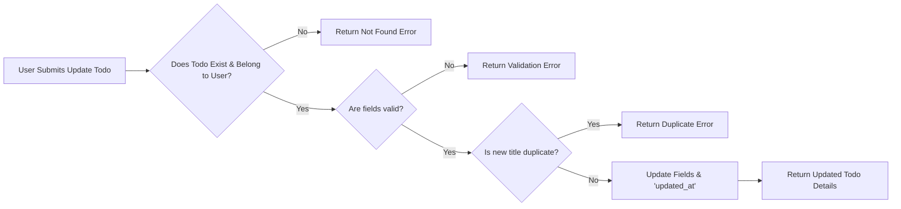
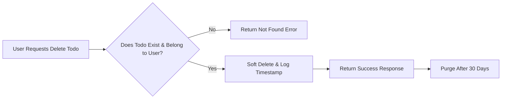
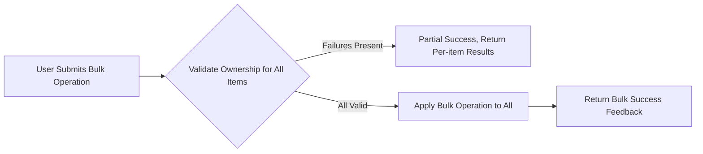

# Functional Requirements for Todo List Application

## 1. Todo Item Creation
### Overview
Defines all business logic and requirements for the creation of a new Todo item by a registered, authenticated user.

### Requirements (EARS)
- WHEN a user submits a request to create a Todo, THE system SHALL require the following fields: title (mandatory), optional description, and optional due date.
- THE system SHALL reject creation if the title is missing, empty, or exceeds 255 characters.
- IF a due date is provided, THEN THE system SHALL validate that the due date is a valid date and not more than 10 years in the future.
- THE system SHALL associate each Todo with the authenticated user's ID; users cannot assign todos to other users.
- THE system SHALL allow immediate marking of a newly created Todo as complete or incomplete (default: incomplete).
- THE system SHALL timestamp each Todo's creation and last modification with ISO 8601 UTC format.
- WHEN a user exceeds 1,000 Todos, THE system SHALL return an error indicating maximum capacity has been reached.
- THE system SHALL prohibit setting duplicate titles for Todos that are active/incomplete (case-insensitive check per user).

### Validation Rules
| Field         | Rule                                               |
|---------------|----------------------------------------------------|
| title         | Required, 1-255 chars, unique (incomplete, per user)|
| description   | Optional, max 1,000 chars                         |
| due date      | Optional, must be a valid date, ≤10 years future  |

### Mermaid Diagram: Todo Creation Flow

## 2. Viewing Todo List
### Overview
Covers all requirements for authenticated users retrieving and viewing their own Todos.

### Requirements (EARS)
- THE system SHALL allow users to retrieve a paginated list of their Todos, defaulting to 20 items per page, ordered by creation date descending.
- THE system SHALL support filtering by status (all, complete, incomplete) and sorting by due date or creation date.
- IF a requested page exceeds the last available page, THEN THE system SHALL return an empty list and a notice of bounds.
- WHEN a user requests Todos, THE system SHALL return only Todos belonging to the authenticated user.
- THE system SHALL allow search by (case-insensitive, partial match) title in the user's Todo list.
- THE system SHALL not expose other users' Todos under any circumstance.

### Validation Rules
| Param            | Rule                                             |
|------------------|-------------------------------------------------|
| page             | ≥1, integer                                     |
| page size        | 1-100, default 20                               |
| status filter    | Enum: all, complete, incomplete                 |
| sort criteria    | Enum: due_date, created_at, default created_at  |
| search           | Optional, partial match, case-insensitive       |

## 3. Updating and Completing Todos
### Overview
Specifies how users may update content or status for their existing Todos.

### Requirements (EARS)
- WHEN a user requests to update a Todo, THE system SHALL verify Todo ownership and existence for the authenticated user.
- THE system SHALL allow updating of the description, title, due date, and completion status only.
- IF a Todo is already deleted, THEN THE system SHALL return an error indicating item not found.
- IF a user attempts to change a completed Todo to incomplete, THEN THE system SHALL permit the operation, maintaining full edit history for auditing.
- THE system SHALL update the last modified timestamp on each change.
- IF a change violates field validation rules (see creation), THEN THE system SHALL return a specific validation error.
- THE system SHALL not allow changing any “created_at” timestamps or user associations.
- WHEN a user attempts to update a Todo with a title already in use (by that user on an active/incomplete Todo), THE system SHALL reject with a duplicate title error.

### Mermaid Diagram: Update Todo Flow

## 4. Deleting Todos
### Overview
Defines the requirements for user-initiated deletion of their own Todos.

### Requirements (EARS)
- WHEN a user requests deletion of a Todo, THE system SHALL confirm item existence and user ownership.
- IF the Todo does not exist or has already been deleted, THEN THE system SHALL return a not-found error.
- THE system SHALL permanently remove the Todo from active queries, but retain deletion logs for 30 days for audit.
- THE system SHALL allow users to view a log of their deleted Todos within 30 days of deletion.
- AFTER 30 days, THE system SHALL permanently erase deleted Todos and all logs.

### Mermaid Diagram: Delete Todo Flow

## 5. Bulk Operations and Constraints
### Overview
Specifies rules for mass actions such as completing, deleting, or filtering Todos.

### Requirements (EARS)
- WHEN a user requests a bulk operation (complete, delete, update), THE system SHALL validate user ownership for all targeted Todos before proceeding.
- IF one or more Todos in a bulk request fail ownership or validity checks, THEN THE system SHALL perform valid changes and return an action-by-item result set indicating success or error per item.
- THE system SHALL support bulk completion and bulk deletion for up to 100 Todos per operation.
- WHERE no valid Todos are present in a bulk operation, THE system SHALL return an error with explanatory details.

### Mermaid Diagram: Bulk Operation Flow

## 6. Permissions and Role-Based Logic
### Overview
Describes user permission boundaries and any logic enforced by system roles.

### Requirements (EARS)
- THE system SHALL restrict all Todo management operations (create, read, update, delete, bulk) to authenticated users only.
- THE system SHALL prohibit access to, or manipulation of, other users’ data under all circumstances.
- WHERE the only defined role is “user”, THE system SHALL enforce these restrictions globally as a default.

### Permission Matrix
| Action           | User |
|------------------|------|
| Create Todo      | ✅   |
| View Own Todos   | ✅   |
| Update Own Todos | ✅   |
| Delete Own Todos | ✅   |
| Bulk Operations  | ✅   |
| Access Others'   | ❌   |

## 7. Business Rules and Validation
### Overview
Summarizes and formalizes mandatory constraints and business rules for all Todo operations.

### Rules (EARS)
- THE system SHALL enforce unique, non-empty, ≤255-char Todo titles per active/incomplete item, per user.
- THE system SHALL accept descriptions up to 1,000 characters.
- THE system SHALL restrict due dates to valid calendar dates, up to 10 years in the future.
- THE system SHALL prevent more than 1,000 active Todos per user.

## 8. Error Handling and Edge Cases
### Overview
Addresses user-facing business logic for invalid scenarios and failure modes, referencing [Error Handling Specifications](./07-error-handling.md).

### Common Scenarios (EARS)
- IF a user attempts to access, modify, or delete a Todo they do not own, THEN THE system SHALL return an ownership or not-found error, without exposing the existence of unauthorized resources.
- IF a submitted field fails business validation, THEN THE system SHALL return a specific, actionable validation error for that field.
- IF bulk operations include invalid items, THEN THE system SHALL return a per-item status in the response.

## 9. Performance and Non-functional Expectations
### Overview
Business expectations for system responsiveness and reliability from a user perspective.

### Expectations (EARS)
- WHEN a user performs any CRUD operation on Todos, THE system SHALL respond within 2 seconds under normal conditions (≤1,000 Todos per user).
- THE system SHALL provide consistent, accurate results for all paginated, filtered, or searched queries.
- THE system SHALL maintain data consistency and durability (no data loss on success responses).

