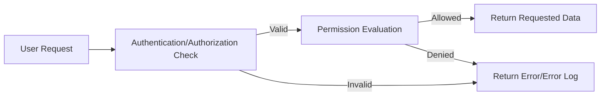

# Security and Compliance Requirements for Todo List Application

## Overview of Security Approach
The Todo List application will be built on the foundation of protecting user privacy, ensuring integrity and confidentiality of user data, and meeting regulatory compliance for personal data. Security best practices must be rigorously followed to prevent unauthorized access, data leaks, or abuse of the system by either users or administrators.

- THE Todo List system SHALL apply the principle of least privilege to all internal and external data access.
- THE system SHALL segregate user data by authenticated identity to prevent cross-account data exposure.
- THE system SHALL enable role-based access enforcement for all business-critical operations.
- THE system SHALL employ proactive measures to detect and respond to suspicious activity in a timely manner.

### Mermaid Diagram: High-Level Security Flow

## User Data Protection Measures
Securing user data—including authentication credentials and all todo content—is essential for user trust and legal compliance.

- THE system SHALL store all user passwords using strong, one-way cryptographic hashing (not reversible and salted).
- THE system SHALL ensure all data related to todos is accessible only by the item’s owner, except for actions carried out by authorized admin roles as defined in business requirements.
- WHEN a user creates, edits, or deletes a todo item, THE system SHALL ensure only the authenticated owner (or authorized admin) can perform this action.
- IF a user attempts to access or modify another user’s data, THEN THE system SHALL deny access and log the event as a potential security incident.
- THE system SHALL store session tokens and authentication credentials in a secure, tamper-resistant manner on the server and client as per business guidelines.
- THE system SHALL encrypt all sensitive personal user data in transit using TLS/SSL during all client-server communications.

## Authentication and Session Security
Ensuring secure authentication, robust session management, and precise token handling is vital for both usability and security.

- THE system SHALL require a valid email and strong password for all account registrations.
- THE system SHALL implement secure, role-validated login and logout flows according to defined authentication requirements.
- THE system SHALL enforce session timeout policies: Access tokens SHALL expire within 30 minutes, refresh tokens SHALL expire within 30 days.
- WHEN a user logs out or revokes their session, THE system SHALL immediately invalidate their tokens.
- WHERE multiple user sessions are allowed, THE system SHALL provide functionality to list and revoke all active sessions for the user.
- IF a user attempts to perform an authenticated action with an expired or invalid token, THEN THE system SHALL return an authentication error and require re-login.
- THE system SHALL log all login, logout, password reset, and critical authentication events for auditability.

## Compliance Requirements (e.g., GDPR, privacy)
Maintaining user trust and upholding user rights are business priorities. The system must enable compliance with major privacy regulations appropriate to the scope of the service.

- THE system SHALL collect and process only the minimum data necessary for todo list functionality (data minimization principle).
- WHEN a user deletes their account, THE system SHALL irreversibly delete all associated personal and todo data within 30 days.
- WHEN a user requests a copy of their data, THE system SHALL provide a machine-readable export of all their todos and personal information within 14 days.
- WHERE required by law (e.g., GDPR, CCPA), THE system SHALL provide mechanisms for users to request correction or deletion of their personal data.
- THE system SHALL make available a privacy notice that explains what data is collected, how it is used, and users' rights regarding their data.

## Auditability and Incident Logging
Comprehensive, tamper-resistant audit logging is essential to detect, investigate, and respond to suspicious or malicious activity while providing accountability for user actions.

- THE system SHALL log all authentication events (login, logout, failed attempts, password resets) with timestamp, user identity, and originating IP address.
- THE system SHALL log all admin actions on user accounts or todos (creations, edits, deletions) with actor identity and reason (where provided).
- IF a security-critical business rule is violated (e.g., access denied, unusual rates of failed logins), THEN THE system SHALL flag the event for review and escalate via incident response process.
- THE system SHALL retain audit logs for at least one year, securely stored and protected against tampering.
- WHEN an incident (as defined in business rules) is detected, THE system SHALL provide an incident notification to system owners within one business day.

---

This document provides business requirements only. All technical implementation decisions belong to developers. The document describes WHAT the system should do, not HOW to build it.