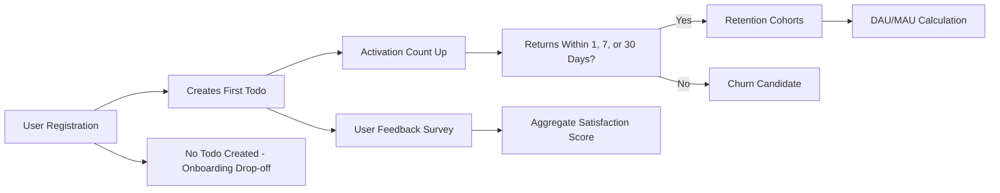

# Success Metrics and Measurement Framework for Todo List Application

## Key Performance Indicators (KPIs)

Success for the Todo List application is determined by a focused set of metrics that directly monitor how well the system serves its intended business purposes: supporting users in managing everyday tasks with minimal friction. All KPIs are described using EARS format to eliminate ambiguity and to create an actionable baseline for backend development and business review.

### System Usage Metrics
- WHEN the system is operational, THE application SHALL record the daily number of actively logged-in users (Daily Active Users, DAU).
- THE system SHALL calculate Monthly Active Users (MAU) by counting unique users active in a rolling 30-day window.
- THE system SHALL record the total number of tasks (todos) created per day and per user.

### Task Completion Rate
- WHEN a user marks a todo as complete, THE application SHALL increment the user's completed tasks count.
- THE system SHALL calculate the percentage of completed todos out of all created todos per user and as a global metric (Task Completion Rate).

### Data Quality and Error Rate
- THE system SHALL record the number of failed operations as a percentage of total attempted business actions (e.g., task creation, update, deletion), segmented by operation and user role.
- WHEN an error occurs during a valid user action, THE system SHALL log the incident type and frequency for business review.

## Service Adoption Metrics

Success depends on the application’s ability to attract and activate new users, as well as on the rate at which users engage with core features.

### User Registration and Onboarding
- THE system SHALL record the number of newly registered users per day, week, and month.
- WHEN a user completes their first todo after registering, THE system SHALL increment the number of activated users.
- THE application SHALL calculate the activation rate as the percentage of new registrants who create at least one todo within 24 hours post-registration.
- THE system SHALL track how many users abandon the application before creating their first todo (onboarding drop-off).

### Feature Utilization
- THE system SHALL monitor the average number of todos created, completed, and deleted per user.
- WHERE users return within one day, seven days, or 30 days, THE system SHALL increment the relevant return user cohort counter (1-day, 7-day, 30-day return rate).

## User Satisfaction Measures

User satisfaction must be measured using direct feedback and indirect indicators reflecting users' real experience of the core todo management capabilities.

### Survey and Feedback
- WHEN a user voluntarily submits feedback or rates the service, THE system SHALL store the rating value and textual feedback for aggregation.
- THE system SHALL calculate the average user satisfaction score based on periodic ratings or feedback.
- WHERE users indicate dissatisfaction (e.g., low rating, explicit complaint), THE system SHALL increment the user dissatisfaction counter and log the instance for business review.

### Support and Issue Reporting
- THE application SHALL record the number of support tickets, bug reports, or complaints by type and outcome (resolved/unresolved) for trend analysis.

## Retention and Usage

Long-term value is demonstrated by users who consistently return and rely on the todo service to manage their tasks. Retention is a key business goal.

### Retention Cohorts
- THE system SHALL measure user retention by tracking the percentage of users who log in at least once after 1 day, 7 days, and 30 days from the date of their registration (retention rate).

### Churn Analysis
- WHERE a registered user shows no activity for 30 days, THE system SHALL flag the user as a churn candidate and count within a churn rate metric.
- IF a churn candidate returns after inactivity, THEN THE system SHALL move the user back to active retention metrics.

### Frequency of Use
- THE system SHALL record the average number of session logins, todos created, todos marked as completed, and todos deleted per user within set periods (daily, weekly, monthly).

## Business Acceptance Criteria

- THE application SHALL achieve a minimum DAU/MAU ratio of 20% within three months of launch.
- THE activation rate (users who create a todo within 24 hours of registration) SHALL exceed 70% in the first six months.
- THE average user satisfaction score SHALL remain above 4 out of 5 on feedback surveys.
- THE churn rate (percentage of users inactive for 30 days) SHALL not exceed 40% in the first year.

## Success Metric Visualization (Mermaid)

## Measurement Boundaries and Rationale

- All metrics are limited to core business actions as defined in the minimal feature set of the application (task creation, completion, deletion, registration, login, feedback, and session activity).
- Metrics intentionally exclude any technical, implementation-level details such as infrastructure performance or internal API responses.
- These requirements strictly express "what" must be measured to declare the system a business success, with the "how" of measurement delegated to developer discretion.

## Document Closure

All metrics and criteria in this report are written to provide business stakeholders with clear, quantifiable evidence for assessing the health, usability, and value of the Todo List application. They ensure complete alignment with the service vision of enabling simple, effective daily task management for all users and provide the foundation for ongoing product iteration and business validation.